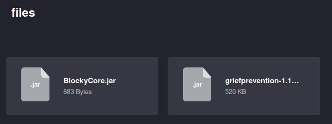
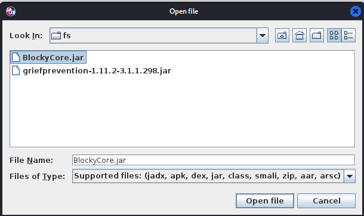
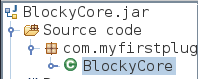
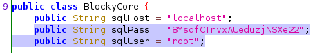
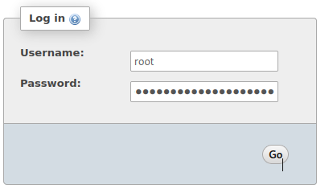
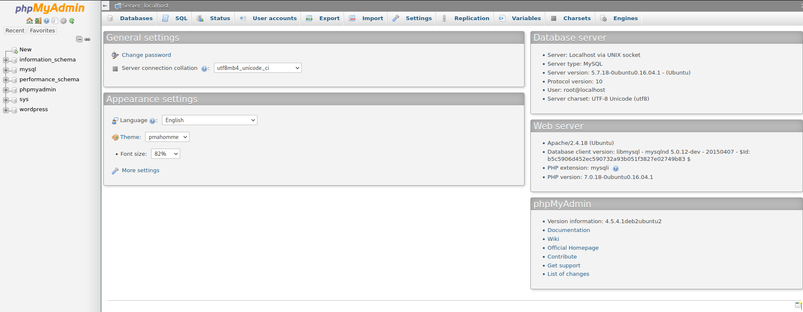
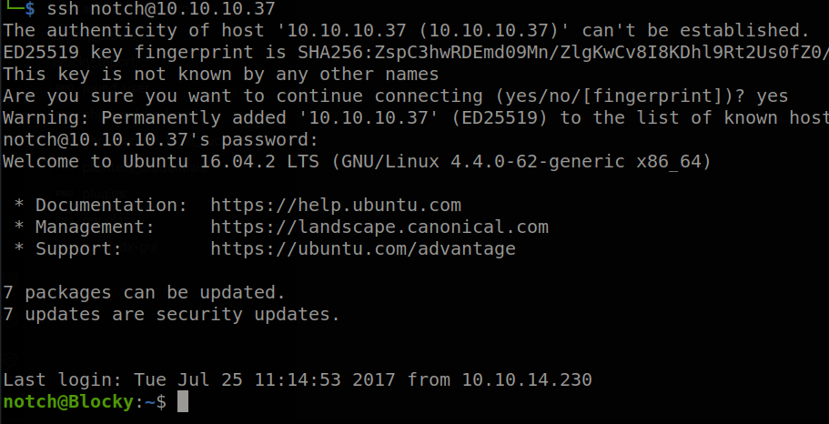
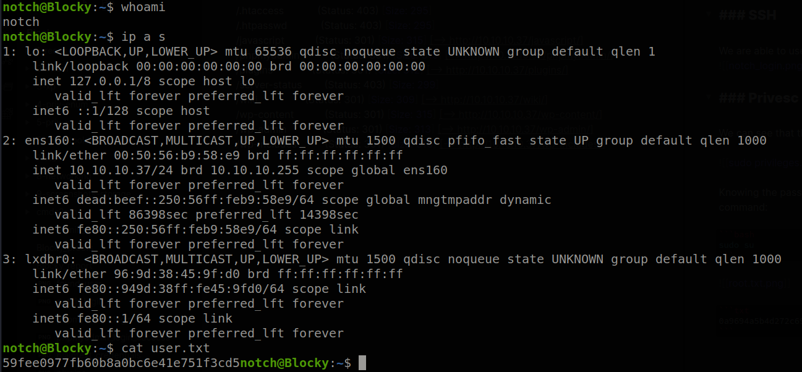
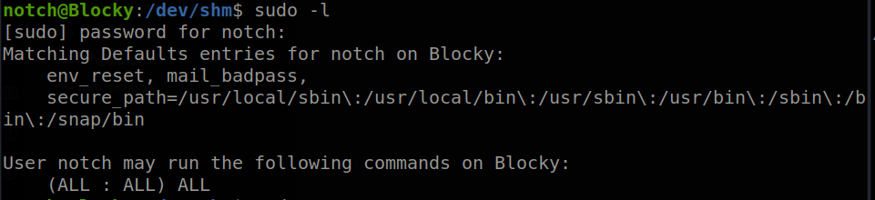
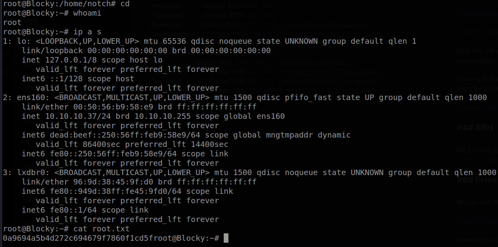

---
title: "Hack The Box: Blocky Report"
author: ["gndpwnd"]
date: "05/08/22"
subject: "Markdown"
keywords: [Markdown, Example]
subtitle: "Box Report"
lang: "en"
titlepage: true
titlepage-color: "1E90FF"
titlepage-text-color: "FFFAFA"
titlepage-rule-color: "FFFAFA"
titlepage-rule-height: 2
book: true
classoption: oneside
code-block-font-size: \scriptsize
---
# Hack The Box: Blocky Report

# Methodologies

I utilized a widely adopted approach to performing penetration testing that is effective in testing how well the Blocky machine is secured.
Below is a breakout of how I was able to identify and exploit the variety of systems and includes all individual vulnerabilities found.

## Information Gathering

The information gathering portion of a penetration test focuses on identifying the scope of the penetration test.
During this penetration test, I was tasked with exploiting the Blocky machine.

The specific IP address was:

- 10.10.10.37

## Penetration

The penetration testing portions of the assessment focus heavily on gaining access to a variety of systems.
During this penetration test, I was able to successfully gain access to the box_name machine.


\newpage

### System IP: 10.10.10.37

#### Service Enumeration

The service enumeration portion of a penetration test focuses on gathering information about what services are alive on a system or systems.
This is valuable for an attacker as it provides detailed information on potential attack vectors into a system.
Understanding what applications are running on the system gives an attacker needed information before performing the actual penetration test.
In some cases, some ports may not be listed.

Server IP Address | Ports Open
------------------|----------------------------------------
10.10.10.37      | **TCP: 25565,22,21,80** \ **UDP: **


\newpage

**Nmap Scan Results:**

Service Scan:

```bash
nmap -Pn -vvv -p 25565,22,21,80 -sC -sV -oN /HTB-boxes/Blocky/1-recon/nmap/ip_tcp.md 10.10.10.37
```

Notable Output:

```txt
21/tcp    open  ftp       syn-ack ttl 63 ProFTPD 1.3.5a
22/tcp    open  ssh       syn-ack ttl 63 OpenSSH 7.2p2 Ubuntu 4ubuntu2.2 (Ubuntu Linux; protocol 2.0)
| ssh-hostkey: 
|   2048 d6:2b:99:b4:d5:e7:53:ce:2b:fc:b5:d7:9d:79:fb:a2 (RSA)
| ssh-rsa AAAAB3NzaC1yc2EAAAADAQABAAABAQDXqVh031OUgTdcXsDwffHKL6T9f1GfJ1/x/b/dywX42sDZ5m1Hz46bKmbnWa0YD3LSRkStJDtyNXptzmEp31Fs2DUndVKui3LCcyKXY6FSVWp9ZDBzlW3aY8qa+y339OS3gp3aq277zYDnnA62U7rIltYp91u5VPBKi3DITVaSgzA8mcpHRr30e3cEGaLCxty58U2/lyCnx3I0Lh5rEbipQ1G7Cr6NMgmGtW6LrlJRQiWA1OK2/tDZbLhwtkjB82pjI/0T2gpA/vlZJH0elbMXW40Et6bOs2oK/V2bVozpoRyoQuts8zcRmCViVs8B3p7T1Qh/Z+7Ki91vgicfy4fl
|   256 5d:7f:38:95:70:c9:be:ac:67:a0:1e:86:e7:97:84:03 (ECDSA)
| ecdsa-sha2-nistp256 AAAAE2VjZHNhLXNoYTItbmlzdHAyNTYAAAAIbmlzdHAyNTYAAABBBNgEpgEZGGbtm5suOAio9ut2hOQYLN39Uhni8i4E/Wdir1gHxDCLMoNPQXDOnEUO1QQVbioUUMgFRAXYLhilNF8=
|   256 09:d5:c2:04:95:1a:90:ef:87:56:25:97:df:83:70:67 (ED25519)
|_ssh-ed25519 AAAAC3NzaC1lZDI1NTE5AAAAILqVrP5vDD4MdQ2v3ozqDPxG1XXZOp5VPpVsFUROL6Vj
80/tcp    open  http      syn-ack ttl 63 Apache httpd 2.4.18 ((Ubuntu))
|_http-server-header: Apache/2.4.18 (Ubuntu)
|_http-title: BlockyCraft &#8211; Under Construction!
|_http-generator: WordPress 4.8
| http-methods: 
|_  Supported Methods: GET HEAD POST OPTIONS
25565/tcp open  minecraft syn-ack ttl 63 Minecraft 1.11.2 (Protocol: 127, Message: A Minecraft Server, Users: 0/20)
Service Info: OSs: Unix, Linux; CPE: cpe:/o:linux:linux_kernel
```


\newpage

#### Initial Access

**Vulnerability Exploited:** Plain Text Credentials

**Vulnerability Explanation:**

Decompiling a java application found on the website hosted by the Blocky machine yields credentials for accessing multiple services on the machine.

**Vulnerability Fix:**

- don't hard code credentials
- don't store credentials in plain text
- remove ability for downloading source code from site.

**Severity:** Critical


\newpage

**Exploit Code:**

Using directory brute forcing tools, we find donwloadable content from the website on port 80.

```txt
==> DIRECTORY: http://10.10.10.37:80/plugins/
```



We can download both java applications and take a look at the source code by reverse-engineering them. In order to reverse-engineer the applications, we need to use a java decompiler.

Run jadx-gui, and open the *BlockyCore.jar* file.



Open the *BlockyCore* class under *myfirstplugin*



Looking at the decompiled code, we can see hardcoded, plaintext credentials:



```txt
sql_user: root
slq_pass: 8YsqfCTnvxAUeduzjNSXe22
```

Looking back at directory brute forcing logs, we can see another directory has been found.

```txt
==> DIRECTORY: http://10.10.10.37:80/phpmyadmin/ 
```

We can see a login for *phpmyadmin*


Using the newly discovered credentials, we can login to the admin dashboard.





With this, we can start looking through various databases and tables for further enumeration.

Looking at the *wordpress* database, under the *wp_users* table, we can see an entry for a user named *notch*.


Surprisingly, we are able to use the following credentials to access the Blocky machine.

```txt
user: notch
pass: 8YsqfCTnvxAUeduzjNSXe22
```



\newpage

**Local.txt Proof Screenshot**



**Local.txt Contents**

```txt
59fee0977fb60b8a0bc6e41e751f3cd5
```


\newpage

#### Privilege Escalation

**Vulnerability Exploited:** User Privileges

**Vulnerability Explanation:**

An attacker can run commands on the target machine as an administrative from a user account with lower level privileges.

**Vulnerability Fix:**

Remove privileges for normal users to run commands as administrative users.

**Severity:** Critical


\newpage

**Exploit Code:**

We can see that the *notch* user can run all commands with sudo privileges.



Knowing the password, we can easily escalate to root by running the following command:

```bash
sudo su
```

\newpage

**Proof Screenshot Here:**



**Proof.txt Contents:**

```txt
0a9694a5b4d272c694679f7860f1cd5f
```

\newpage

## Maintaining Access

Maintaining access to a system is important to us as attackers, ensuring that we can get back into a system after it has been exploited is invaluable.
The maintaining access phase of the penetration test focuses on ensuring that once the focused attack has occurred (i.e. a buffer overflow), we have administrative access over the system again.
Many exploits may only be exploitable once and we may never be able to get back into a system after we have already performed the exploit.

## House Cleaning

The house cleaning portions of the assessment ensures that remnants of the penetration test are removed.
Often fragments of tools or user accounts are left on an organization's computer which can cause security issues down the road.
Ensuring that we are meticulous and no remnants of our penetration test are left over is important.

After collecting trophies from the Blocky machine was completed, I removed all user accounts, passwords, and malicious codes used during the penetration test.
 should not have to remove any user accounts or services from the system.


\newpage

# Appendix - Additional Items

## Appendix - Proof and Local Contents:

IP (Hostname) | Local.txt Contents | Proof.txt Contents
--------------|--------------------|-------------------
10.10.10.37   |  59fee0977fb60b8a0bc6e41e751f3cd5 | 0a9694a5b4d272c694679f7860f1cd5f


\newpage

## Appendix - /etc/passwd contents

```txt
root:x:0:0:root:/root:/bin/bash
daemon:x:1:1:daemon:/usr/sbin:/usr/sbin/nologin
bin:x:2:2:bin:/bin:/usr/sbin/nologin
sys:x:3:3:sys:/dev:/usr/sbin/nologin
sync:x:4:65534:sync:/bin:/bin/sync
games:x:5:60:games:/usr/games:/usr/sbin/nologin
man:x:6:12:man:/var/cache/man:/usr/sbin/nologin
lp:x:7:7:lp:/var/spool/lpd:/usr/sbin/nologin
mail:x:8:8:mail:/var/mail:/usr/sbin/nologin
news:x:9:9:news:/var/spool/news:/usr/sbin/nologin
uucp:x:10:10:uucp:/var/spool/uucp:/usr/sbin/nologin
proxy:x:13:13:proxy:/bin:/usr/sbin/nologin
www-data:x:33:33:www-data:/var/www:/usr/sbin/nologin
backup:x:34:34:backup:/var/backups:/usr/sbin/nologin
list:x:38:38:Mailing List Manager:/var/list:/usr/sbin/nologin
irc:x:39:39:ircd:/var/run/ircd:/usr/sbin/nologin
gnats:x:41:41:Gnats Bug-Reporting System (admin):/var/lib/gnats:/usr/sbin/nologin
nobody:x:65534:65534:nobody:/nonexistent:/usr/sbin/nologin
systemd-timesync:x:100:102:systemd Time Synchronization,,,:/run/systemd:/bin/false
systemd-network:x:101:103:systemd Network Management,,,:/run/systemd/netif:/bin/false
systemd-resolve:x:102:104:systemd Resolver,,,:/run/systemd/resolve:/bin/false
systemd-bus-proxy:x:103:105:systemd Bus Proxy,,,:/run/systemd:/bin/false
syslog:x:104:108::/home/syslog:/bin/false
_apt:x:105:65534::/nonexistent:/bin/false
lxd:x:106:65534::/var/lib/lxd/:/bin/false
messagebus:x:107:111::/var/run/dbus:/bin/false
uuidd:x:108:112::/run/uuidd:/bin/false
dnsmasq:x:109:65534:dnsmasq,,,:/var/lib/misc:/bin/false
notch:x:1000:1000:notch,,,:/home/notch:/bin/bash
mysql:x:110:117:MySQL Server,,,:/nonexistent:/bin/false
proftpd:x:111:65534::/run/proftpd:/bin/false
ftp:x:112:65534::/srv/ftp:/bin/false
sshd:x:113:65534::/var/run/sshd:/usr/sbin/nologin
```

\newpage

## Appendix - /etc/shadow contents

```txt
root:!:17349:0:99999:7:::
daemon:*:17212:0:99999:7:::
bin:*:17212:0:99999:7:::
sys:*:17212:0:99999:7:::
sync:*:17212:0:99999:7:::
games:*:17212:0:99999:7:::
man:*:17212:0:99999:7:::
lp:*:17212:0:99999:7:::
mail:*:17212:0:99999:7:::
news:*:17212:0:99999:7:::
uucp:*:17212:0:99999:7:::
proxy:*:17212:0:99999:7:::
www-data:*:17212:0:99999:7:::
backup:*:17212:0:99999:7:::
list:*:17212:0:99999:7:::
irc:*:17212:0:99999:7:::
gnats:*:17212:0:99999:7:::
nobody:*:17212:0:99999:7:::
systemd-timesync:*:17212:0:99999:7:::
systemd-network:*:17212:0:99999:7:::
systemd-resolve:*:17212:0:99999:7:::
systemd-bus-proxy:*:17212:0:99999:7:::
syslog:*:17212:0:99999:7:::
_apt:*:17212:0:99999:7:::
lxd:*:17349:0:99999:7:::
messagebus:*:17349:0:99999:7:::
uuidd:*:17349:0:99999:7:::
dnsmasq:*:17349:0:99999:7:::
notch:$6$RdxVAN/.$DFugS5p/G9hTNY9htDWVGKte9n9r/nYYL.wVdAHfiHpnyN9dNftf5Nt.DkjrUs0PlYNcYZWhh0Vhl/5tl8WBG1:17349:0:99999:7:::
mysql:!:17349:0:99999:7:::
proftpd:!:17349:0:99999:7:::
ftp:*:17349:0:99999:7:::
sshd:*:17349:0:99999:7:::
```

		
